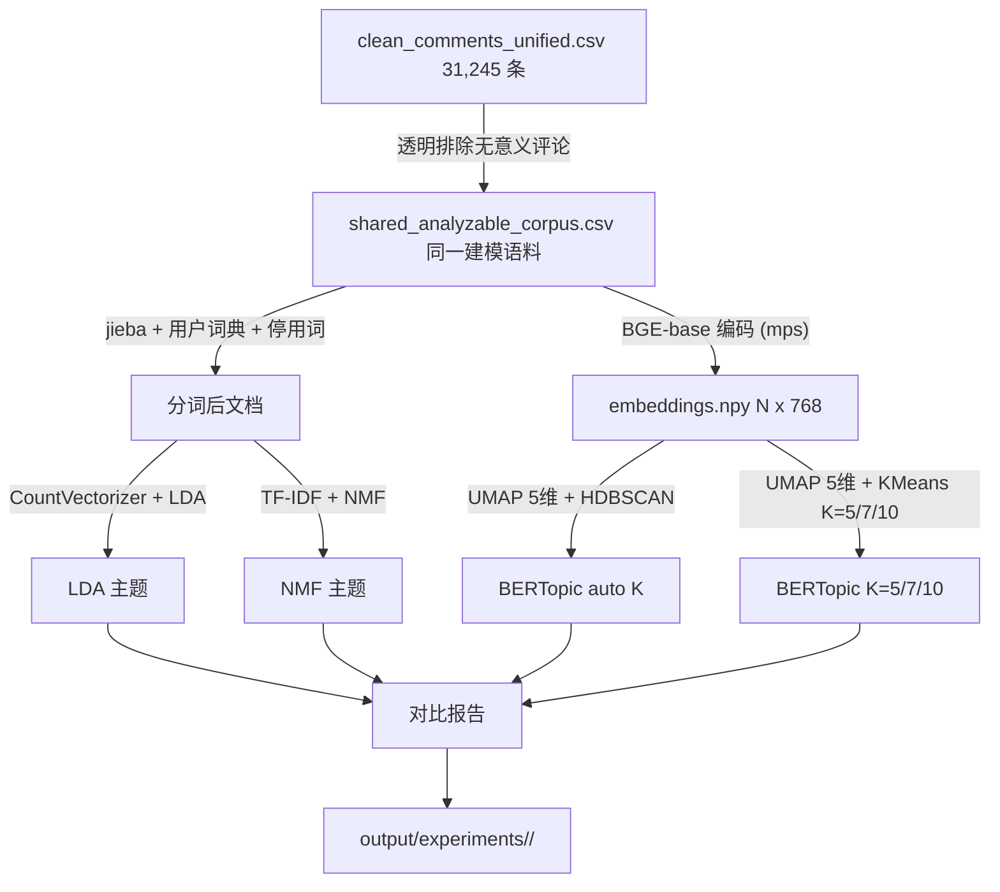

# 清理 + 重做：全量语料 LDA vs BERTopic（bge-base）

## 项目目标（先读）

这个项目研究的是：**当机器人在公开视频/社交媒体语境中呈现成功、强势、中性、弱势或失败状态时，评论者如何重新理解机器人与人的关系**。核心不是判断机器人技术本身好坏，而是分析评论中出现的关系想象、主体归属、能力评价、情感反应与社会位置。

当前阶段是 **Phase 1：数据处理 + 探索性主题建模**。目标是用清洗后的评论语料，帮助研究者发现可解释的话语主题，为后续 codebook、人工编码、理论抽样和近读提供线索。

本轮工作的具体目标：

- 清理旧的 lexicon-dependent 实验，避免把探索性词典误当 ground truth。
- 在同一份 `shared_analyzable_corpus.csv` 上比较 LDA / NMF / BERTopic，观察不同方法抽出的主题结构是否一致。
- 使用 `post_category_by_post.csv` 中的 `状态|角色` 结构，对比不同精选帖子、机器人状态、人与机器人关系角色下的主题分布。
- 保留一个独立的关键词筛选工具，让研究者可以按关键词回到原始评论中读样本，但不让它污染主题建模主流程。
- 把所有方法假设、过滤规则、错误教训、复现步骤和两轮自检结果写入文档，方便新人接手。

本轮明确**不做**：

- 不训练 judge 模型。
- 不把 `relation_lexicon_v1.csv` 或 `robot_reference_lexicon.csv` 当标准答案。
- 不把关键词命中当作分类标签。
- 不用 POS 词性标注过滤主题建模输入；POS 只作为后续解释辅助或 codebook 阶段的可选诊断。
- 不把主题模型结果直接当最终理论结论；主题模型只提供候选主题和近读入口。

## 0. 我们犯过的错误清单（先于动手，写进 [phase1/RUNBOOK.md](phase1/RUNBOOK.md)）

每条都要在新流程里规避。后接手者必读。

### 0.1 方法论错误

| # | 错误 | 现象 | 原因 | 避免方式 |
|---|---|---|---|---|
| M1 | **lexicon 子集预过滤** | 把 31,245 → 8,421 条做主题建模 | 主题建模本质无监督，预过滤等于偷偷加了一个分类器 | 全量输入；lexicon 只能在事后做评估（且当前阶段也不做） |
| M2 | **lexicon 当 ground truth** | 把 6 关系 + 4 指代当"标准答案"算混淆矩阵 | 这些是研究者的探索性词典，没有 IRR 验证 | 不把 lexicon 当 judge；要 judge 就先做 codebook + IRR |
| M3 | **隐式短文档过滤** | `build_topic_documents` 默认 `min_tokens=3` 把 31,245 → 13,334（丢 56%） | 函数默认值不显眼 | 在脚本最开头打印过滤前后行数；过滤参数显式传值 |
| M4 | **K 选择只看一个指标** | LDA perplexity 单调降；TF-IDF KMeans silhouette 只有 0.06 | 单指标在 BoW 短文本上不可靠 | 多指标（perplexity + topic coherence + 主题大小均衡 + 人工核读） |
| M5 | **char_bigram 静默回退** | jieba 没装时 `_setup_tokenizer` 自动用 char_bigram，主题词全是 "机器/器人/拉松" 这种 2 字碎片 | fallback 没报错 | 启动期严格校验：缺 jieba 直接 raise；分词器选择写进 `config.json` |
| M6 | **LDA 用 TF-IDF 输入** | 把 TF-IDF 矩阵喂给 LDA | LDA 假设输入是词频计数（count），TF-IDF 会破坏生成模型假设 | LDA 一律用 `CountVectorizer`；NMF 才用 `TfidfVectorizer` |
| M7 | **不同模型看到不同语料** | LDA 因短文本过滤少看一半评论，BERTopic 看全量，二者差异混入语料差异 | 比较对象不一致 | 先构造一个 shared analyzable corpus；LDA/NMF/BERTopic 主比较都用同一批评论；另保留 full-input 计数只作为覆盖率报告 |
| M8 | **把 post_category 当独立样本** | 爆款帖子评论量大，某一帖可能主导 category 结论 | 16 个 post 是理论抽样单元，不是 i.i.d. 评论池 | 输出 `topic × post_id`；先在每个 post 内算主题比例，再按 robot status/category 汇总；增加 leave-one-post-out sensitivity |

### 0.2 工程错误

| # | 错误 | 现象 | 原因 | 避免方式 |
|---|---|---|---|---|
| E1 | **CountVectorizer 在 BERTopic 翻车** | `ValueError: max_df corresponds to < documents than min_df` | BERTopic 的 c-TF-IDF 输入是「按主题拼成的 K 个长文档」，用 `min_df=5, max_df=0.6` 文档级阈值会矛盾 | BERTopic 的 vectorizer 用 `min_df=1, max_df=1.0`；token 频率限制放在 c-TF-IDF 之后再做 top-k 截取 |
| E2 | **代理卡住下载** | pip 跑 16 分钟一个包没装上，连到 `localhost:7897` 代理 ESTABLISHED 但卡住 | 系统级代理被自动检测到 | 装包前 `env \| grep -i proxy`；必要时 `unset HTTPS_PROXY HTTP_PROXY ALL_PROXY` 后再 pip install |
| E3 | **pip 进度被 tail 吞掉** | 用 `pip install ... \| tail -15` 看不到进度，只能干等 | tail 在 stdout 没刷新就不显示 | `pip install ... > /tmp/pip.log 2>&1 &` + 定期 `tail -f` |
| E4 | **embedding 不缓存** | 每次重跑 BERTopic 都重编码 6000 条评论 | 没存中间产物 | encode 后立即 `np.save(run_dir/"embeddings.npy", embeddings)`，下次先查缓存 |
| E5 | **模型大小拍脑袋** | 想用 large（1.3GB，45 min 下载），实际网速 150 KB/s 拖死流程 | 没量化下载预估 | 下载前 `du -sh ~/.cache/huggingface/hub/<model>`，按当前网速算 ETA；研究项目默认 base，small 仅做冒烟测试 |

### 0.3 流程错误

| # | 错误 | 现象 | 原因 | 避免方式 |
|---|---|---|---|---|
| P1 | **多个旧实验混在 output/experiments/** | 4 个 run_id 共存，新人不知道哪个是当前结论 | 没有"标记 active vs archived" | `output/experiments/registry.csv` 加 `status` 列；archived 移到子目录 `_archived/` |
| P2 | **代码与产物不同步** | `topic_relation_v2.py` 还在但产物已应该删 | 删数据不删代码 | 同一次清理；保留代码也要在文件头标注 `# DEPRECATED 2026-05-09` |
| P3 | **plan 与代码漂移** | will.md 提到 BERTopic，实际是 LDA char_bigram | 没有"这次实验跑了什么"的 single source of truth | 每个实验 run_id 必须含 `config.json`，will.md 决策日志引用 run_id |

### 0.4 BERTopic 官方注意事项（来自 [BERTopic FAQ](https://maartengr.github.io/BERTopic/faq.html)）

每条都用「条目 + 我们的处理 + 与上面错误清单交叉引用」的格式，新人对照实现。

| # | FAQ 主题 | 要点（原文摘要） | 我们的处理 / 写进代码 |
|---|---|---|---|
| **C1** | **中文必须自定义 jieba CountVectorizer** | "CountVectorizer tokenizes text by splitting whitespace which does not work for Chinese. To get it to work, you will have to create a custom CountVectorizer with jieba." | `phase1/topic_modeling.py` 必须传 `vectorizer_model=CountVectorizer(tokenizer=_jieba_tokenize, token_pattern=None, ...)`；token_pattern 必须设 None 否则 sklearn 会发警告并用默认 |
| **C2** | **停用词时机：先 embed 再去停用词**（反直觉） | "removing stop words as a preprocessing step is not advised as the transformer-based embedding models that we use need the full context to create accurate embeddings. Instead, we can use the CountVectorizer to preprocess our documents **after** having generated embeddings" | BGE encoder 输入用**原文**（带停用词、表情、emoji）；停用词只在 CountVectorizer 的 `stop_words=` 参数里去，让 c-TF-IDF 阶段过滤主题词；**严禁**对 docs 提前去停用词再喂给 BGE |
| **C3** | **结果不可重现（UMAP 随机）** | "Due to the stochastic nature of UMAP, the results from BERTopic might differ even if you run the same code multiple times. ... set a `random_state` in UMAP" | UMAP 必须传 `random_state=42`；config.json 同时记录 BERTopic、UMAP、HDBSCAN、KMeans 的 seed |
| **C4** | **calculate_probabilities 默认关闭** | "Calculating the probabilities is quite expensive ... only use it if you do not mind waiting a bit before the model is done running or if you have less than a couple of hundred thousand documents" | 我们 31k 文档**默认 False**；只在最终选定 K 后做一次 `topic_model.approximate_distribution(docs)` 替代（HDBSCAN 之外的聚类要用这个） |
| **C5** | **内存（low_memory）** | "set `low_memory` to True when instantiating BERTopic. This may prevent blowing up the memory in UMAP" | 31k × 768 维 ≈ 95 MB embedding，本机 mac 没问题；保险起见 `BERTopic(low_memory=True)`，避免后期评论增到几十万时改 |
| **C6** | **如何减少 outlier**（HDBSCAN） | 三种方法：1) `min_samples` 单设比 `min_cluster_size` 小；2) 训练完用 `topic_model.reduce_outliers(docs, topics)`；3) 直接换 KMeans（无 outlier） | 我们已用 KMeans K=5/7/10 作并行路线；HDBSCAN 路线**额外加一步** `reduce_outliers(strategy="c-tf-idf")` 把异常点重新指派；保留原始 outlier 标签为 `topic_raw`，重新指派后为 `topic_assigned` |
| **C7** | **主题数控制** | "set the `min_topic_size` ... higher (e.g., 300)" / "n_neighbors ... higher (e.g., 200)" / "nr_topics='auto'" | HDBSCAN 不只跑一个值：`min_cluster_size=100/200/400` 做 sensitivity；主报告默认解读 200；UMAP `n_neighbors=15`（默认）；最终若主题过多可用 `nr_topics="auto"` 让模型合并相似主题（写在 `comparison.md` 的 sensitivity 节） |
| **C8** | **离线运行 / 网络** | "sentence-transformers ... it searches automatically for an embedding model locally. If it cannot find one, it will download" | 下载前先 `huggingface-cli download BAAI/bge-base-zh-v1.5` 全量到 `~/.cache/huggingface/hub/`；下载完后 `python -c "SentenceTransformer('BAAI/bge-base-zh-v1.5')"` 冒烟测试；这条与 **E2/E5** 强相关——网络慢就一定要确保完整下载 |
| **C9** | **Apple Silicon 已知坑** | "There are known issues with upstream dependencies for this architecture, for example numba" | 我们 mps 已能跑通；若未来 numba/hdbscan 报 arm64 错，fallback 是 VS Code Dev Container（写进 RUNBOOK 的 troubleshooting） |
| **C10** | **是否需要预处理** | "No. By using document embeddings there is typically no need to preprocess ... if you have data that contains a lot of noise, for example, HTML-tags, then it would be best to remove them" | 小红书评论的 `[doge][笑哭R]` 等表情标记**保留给 BGE**（提供情感上下文），但在 jieba tokenizer 里去掉（c-TF-IDF 不让它们进主题词）；URL / @用户名 / 长数字 ID 在 `clean_text` 里仍然去掉（噪声不是上下文） |

**关键交叉引用**：

- **E1 + C2 共同含义**：BERTopic 的两个数据流要分清——
  - `embedding_model.encode(docs)` 看到**原文**（C2、C10）
  - `vectorizer_model` 内部的 `CountVectorizer` 看到**分词后版本**（C1）
  - 这两个流不要互相污染。我们之前 E1 翻车就是因为没区分清楚 `min_df` 是给文档级 BoW 还是 c-TF-IDF。
- **C4 + C6 共同含义**：用 KMeans 时 `calculate_probabilities` 无效（FAQ 注："The calculate_probabilities parameter is only used when using HDBSCAN or cuML's HDBSCAN"），要文档-主题分布得用 `approximate_distribution`。
- **M3 + C7 + C5 共同含义**：所有"过滤/限制/降维"参数都要显式列在 `config.json`，并打印过滤前后行数；后接手者一看就知道这次跑了什么。

---

## 1. 清理清单（删除前会让你确认）

> **重新评估说明**（响应"保留关键词筛选流程"诉求）：
> §1.3 把原本要删的 `relation_detection.py` 从「删除」降为「归档备份」，并新建独立的、用途更通用的 [phase1/keyword_filter.py](phase1/keyword_filter.py)（详见 §2.6）。lexicon CSV 在 §1.4 的定位由「冷藏数据资产」升级为「关键词筛选工具的可选输入」。其余删除项保持不变。

### 1.1 删除（output/experiments/）—— **保持原方案**

四个旧 run_id 子目录都是「实验数据」，按用户意见删：

- `output/experiments/2026-05-09_relation_detect_v1_lexicon/` — 旧 lexicon baseline 实验
- `output/experiments/2026-05-09_topic_relation_v2_jieba/` — M1+M2+M3 lexicon-dependent 主题建模
- `output/experiments/2026-05-09_topic_bertopic_bge-small-zh-v1_5/` — 在 lexicon 子集上跑的 BERTopic
- `output/experiments/2026-05-09_topic_bertopic_bge-base-zh-v1_5/` — 上次中断留下的空目录
- `output/experiments/registry.csv` 里旧 run_id 行——清空保留表头

注：关键词筛选工具的输出**不**写到 `output/experiments/`，而是写到新目录 `output/explore/<timestamp>_<name>/`，避免被「实验/正式分析结果」混淆。

### 1.2 删除（output/phase1/data/）lexicon 衍生产物 —— **保持原方案**

这些是旧 lexicon 实验直接 dump 的统计表，关键词筛选工具会按需即时再算，不需要保留：

- `relation_v1_*.csv`（7 个）
- `reference_type_*.csv` + `reference_type_summary.md`（5 个）
- `topic_quick_cluster*.csv` + `topic_quick_clusters.csv`（3 个）
- `compare_lda_*.csv` + `compare_tfidf_*.csv` + `compare_topic_methods_*.csv`（8 个）

保留：`clean_comments_unified*.csv`、`clean_l1*/clean_l2*.csv`（这些是清洗产物，与 lexicon 无关）。

### 1.3 删除/归档（代码）—— **调整**

| 文件 | 原方案 | 新方案 | 理由 |
|---|---|---|---|
| [phase1/relation_detection.py](phase1/relation_detection.py) | 删 | **归档：移到 `phase1/_archived/relation_detection.py`** + 文件头加 `# DEPRECATED` 注释 | 它的"按 lexicon 关键词筛选评论"内核就是用户要保留的功能；保留代码体作 reference，但不再当主流程；新工具 `phase1/keyword_filter.py` 用更通用的 API 重写 |
| [phase1/topic_relation_v2.py](phase1/topic_relation_v2.py) | 删 | **删** | 它是 lexicon 预过滤 + 跑 LDA 的实验脚本，与新主题建模流程功能重合，无保留价值 |
| [phase1/topic_bertopic.py](phase1/topic_bertopic.py) | 删 | **删** | 当前版本带 lexicon 子集逻辑，会被新 `phase1/topic_modeling.py` 完全覆盖 |

`phase1/_archived/` 目录是新建的归档区，README 写明：「这些代码不在主流程里，仅供参考；新人不要 import。」

### 1.4 保留并**升级为关键词筛选工具的输入**（不再是冷藏）

| 资产 | 在新方案中的角色 |
|---|---|
| [config/relation_lexicon_v1.csv](config/relation_lexicon_v1.csv) | `keyword_filter.py` 的可选输入：`--lexicon config/relation_lexicon_v1.csv --category service` |
| [config/robot_reference_lexicon.csv](config/robot_reference_lexicon.csv) | 同上，针对指代类型 |
| [phase1/lexicons.py](phase1/lexicons.py) | 提供 ROLE_PATTERNS 给 `keyword_filter.py` 当 preset；其余不动 |
| [phase1/features.py](phase1/features.py) `apply_lexicons` | **不再被默认 pipeline 调用**（详见 §1.5），但保留函数体；`keyword_filter.py` **不**复用它（语义不同：features 是给主题建模当变量，keyword_filter 是给人看评论） |
| [phase1/analysis.py](phase1/analysis.py) `role_aggregate / personhood_outputs / meme_outputs / boundary_outputs` | 同上，归档不删 |

每个保留文件头加注释：

```python
# 注：此模块属于 lexicon 探索阶段产物。
# - 新主题建模流程（phase1/topic_modeling.py）不依赖。
# - 关键词筛选工具（phase1/keyword_filter.py）只复用 ROLE_PATTERNS / 词典 CSV，不调用 apply_lexicons。
# - 如需把 lexicon 当判别器使用，先做 IRR 验证。
```

### 1.5 简化 [phase1/pipeline.py](phase1/pipeline.py)

把 `apply_lexicons / role_aggregate / personhood_outputs / meme_outputs / boundary_outputs` 这一段（[phase1/pipeline.py:111-121](phase1/pipeline.py)）从默认流水线移除；保留为可选 flag `--legacy-lexicon-features`，默认关闭。这样跑 `python run_phase1.py` 只做清洗，不再产 lexicon 衍生表。

### 1.6 保留不动（必要工具）

- [config/topic_modeling/domain_user_dict.txt](config/topic_modeling/domain_user_dict.txt) — jieba 用户词典（不是分类 lexicon，是分词辅助）
- [config/topic_modeling/general_stopwords.txt](config/topic_modeling/general_stopwords.txt)
- [config/topic_modeling/platform_noise_tokens.csv](config/topic_modeling/platform_noise_tokens.csv)
- [config/topic_modeling/corpus_noise_tokens.csv](config/topic_modeling/corpus_noise_tokens.csv)
- [phase1/topic_lda.py](phase1/topic_lda.py) — 提供 jieba/分词/停用词加载工具，新流程会复用 `_setup_tokenizer` 等纯工具函数

---

## 2. 新流程

### 2.1 输入

原始输入仅 1 个：[output/phase1/data/clean_comments_unified.csv](output/phase1/data/clean_comments_unified.csv) —— 31,245 条评论，全量。

但**主比较不直接使用全部 31,245 条**，而是先构造一个 `shared_analyzable_corpus.csv`：同一批评论同时喂给 LDA / NMF / BERTopic。这样可以排除明显无意义评论，又避免不同模型因看到不同语料而不可比。

`shared_analyzable_corpus.csv` 的排除规则必须透明、可复现、可审计：

- 去掉空文本、清洗后长度 `< 4` 的评论。
- 读取 [config/topic_modeling/comment_content_filter.json](config/topic_modeling/comment_content_filter.json)，按配置排除：
  - `pure_emoji.enabled=true`：去掉仅由 emoji / ZWJ / 肤色修饰符等组成的评论；含汉字、拉丁字母或数字的保留。
  - `only_mentions.enabled=true`：去掉 @ 后只剩空白与标点的评论；正文里带 @ 但仍有实质文字则保留。
  - `repeated_fragment.enabled=true`：去掉整句由同一短片段重复构成的评论（例如 哈哈哈哈、666666），阈值使用 JSON 中的 `max_period_chars/min_repeat_count/min_total_chars`。
- 去掉纯标点 / 纯 URL / 纯数字 ID。
- 去掉 jieba 分词后有效 token 数 `< 2` 的评论；有效 token 指：不在停用词表、不在平台噪声词表、长度合理的词。此规则保留为基础质量门槛，但必须记录排除数量，后续如误删多再调。
- 去掉重复评论文本（保留第一条，并在 `excluded_meaningless.csv` 里记录重复原因）。
- **不**因为评论短、口语化、含表情、含讽刺而删除；这些可能正是机器人失败评论的重要语义。

输出两张审计表：

- `shared_analyzable_corpus.csv`：主建模语料，含 `comment_id/post_id/post_category/robot_status/human_role/comment/clean_text/token_count`。
- `excluded_meaningless.csv`：被排除评论，含 `exclude_reason`，用于人工抽查是否误删。

`post_category` 直接读取 [config/post_category_by_post.csv](config/post_category_by_post.csv)，字段格式为 `状态|角色`：

- `robot_status = 类别.split("|")[0]`，例如：`成功 / 中性 / 失败 / 弱势 / 强势`。
- `human_role = 类别.split("|")[1]`，例如：`被超越者 / 观众 / 抢救者 / 服务者 / 评价者 / 同伴`。

不再新建 `config/post_status_map.csv`。`post_category_by_post.csv` 是 single source of truth。

严谨性要求：

- `comparison.md` 必须说明：`robot_status` 与 `human_role` 来自研究设计中的帖子抽样标签，不是模型自动发现的类别。
- `强势` 不应强行并入 `成功`：先保留为独立 status；如果报告中需要合并为“成功/强势”，只能作为二级汇总，并保留原始五类结果。
- 如果某一类只有 1 个 post，则该类只做描述性展示，不做强推论；如果至少 2 个 post，才做 leave-one-post-out sensitivity。

### 2.1.1 POS 词性标注的定位

**结论：POS 不进入本次主题建模主流程。**

原因：

- BERTopic 的语义聚类依赖 BGE embeddings，提前按词性过滤会破坏上下文。
- LDA/NMF 的目标是探索评论话语主题，过早只保留名词/动词会丢掉态度词、语气词、拟声/表情化表达，而这些恰恰可能解释机器人失败评论里的嘲讽、怜爱、恐惧、替代焦虑。
- 中文社媒短评论的 POS 标注误差较高，特别是网络词、拟声词、表情化词、机器人领域复合词；把 POS 作为过滤门槛会制造不可见偏差。

POS 更适合放在后续场景：

- **主题解释辅助**：主题跑完后，对每个 topic 的 top terms / 代表评论做 POS 分布，帮助区分“对象词”（机器人/人/狗）、“动作词”（跑/摔/救）、“评价词”（可爱/吓人/废物）。
- **关键词筛选增强**：在 `keyword_filter.py` 里可选输出 `pos_tags`，帮助人工看某些关键词在句中是名词、动词还是评价词。
- **codebook/人工编码阶段**：当需要区分关系动作、评价维度、主体指代时，再用 POS 作为辅助特征，而不是作为主题建模输入过滤。

因此本次只做 jieba 分词 + 用户词典 + 停用词，不做 `posseg` 主流程过滤；可在 `comparison.md` 的附录中选做 topic-level POS diagnostic。

### 2.2 流程图



### 2.3 新代码：[phase1/topic_modeling.py](phase1/topic_modeling.py)（单一入口）

唯一新模块。每条 FAQ 注意事项 (C1-C10) 的具体落地位置都标了行内注释，便于 review。

```python
@dataclass
class TopicModelingConfig:
    run_id: str
    input_csv: Path
    comment_content_filter_json: Path = Path("config/topic_modeling/comment_content_filter.json")
    post_category_by_post_csv: Path = Path("config/post_category_by_post.csv")
    embedding_model: str = "BAAI/bge-base-zh-v1.5"    # 默认 base（C8 - 模型大小决定要不要预下载）
    device: str = "mps"                               # C9 - Apple Silicon 主路径
    lda_k_values: tuple = (5, 7, 10, 12)
    bert_kmeans_k_values: tuple = (5, 7, 10)
    bert_hdbscan_min_cluster_sizes: tuple = (100, 200, 400)  # C7 - sensitivity；主报告默认 200
    bert_hdbscan_min_samples: int | None = None       # C6 - 默认 None=等于 min_cluster_size；调小可减 outlier
    bert_reduce_outliers: bool = True                 # C6 - HDBSCAN 跑完用 reduce_outliers 重新指派异常点
    min_clean_chars: int = 4                          # shared corpus 基础过滤；内容噪音规则见 comment_content_filter_json
    min_effective_tokens: int = 2                     # shared corpus 过滤：同一批语料给所有模型
    random_seed: int = 42                             # C3 - UMAP/KMeans 都用此 seed
    low_memory: bool = True                           # C5 - BERTopic(low_memory=True) 防 UMAP 爆内存
    calculate_probabilities: bool = False             # C4 - 31k 文档默认 False；要分布另用 approximate_distribution
    sample_per_topic: int = 30
    top_terms: int = 15
    cache_embeddings: bool = True                     # E4 修复：embeddings.npy 持久化


def _jieba_tokenize_for_ctfidf(text: str) -> list[str]:
    """C1 - 中文必须自定义 jieba CountVectorizer。
    注意：此 tokenizer 仅用于 c-TF-IDF（CountVectorizer），不用于 BGE encoder。"""
    # clean_text 去 URL/@/数字 ID/emoji（C10：HTML 类噪声该去）
    # 但 [doge][笑哭R] 等小红书表情标记会在这里被 XHS_BRACKET 去掉——只在 c-TF-IDF 流去；
    # BGE 流看到的是原文，含表情和颜文字（保留情感上下文）
    ...


def build_shared_analyzable_corpus(cfg, raw_df, stopwords) -> tuple[pd.DataFrame, pd.DataFrame]:
    """构造同一批主建模语料。
    读取 comment_content_filter.json 与 post_category_by_post.csv。
    返回 shared_df 与 excluded_df。LDA / NMF / BERTopic 主比较全部使用 shared_df。"""


def run_lda_full(cfg, shared_df, stopwords) -> dict:
    """LDA 流。输入是 jieba 分词后版本；向量化必须用 CountVectorizer（M6 修复）。"""


def run_nmf_full(cfg, shared_df, stopwords) -> dict:
    """NMF 流。输入是 jieba 分词后版本；向量化用 TfidfVectorizer。"""


def run_bertopic_full(cfg, docs_df, stopwords) -> dict:
    """BGE encode (with cache) → UMAP → (HDBSCAN + KMeans) → c-TF-IDF (jieba).

    核心数据流（C2 关键反直觉点 + C10）:
        docs_raw ──► encoder.encode(...)  # 原文喂 BGE，含表情、感叹号
                ╲
                 ╲──► CountVectorizer(_jieba_tokenize_for_ctfidf, stop_words=sw)
                      内部对原文跑 jieba 分词、过滤 → c-TF-IDF
        切勿: 提前对 docs 去停用词再喂 encoder.encode()
    """
    # 1. encode（带缓存）
    if cfg.cache_embeddings and cache_path.exists():
        embeddings = np.load(cache_path)
    else:
        embeddings = encoder.encode(docs_raw, normalize_embeddings=True, ...)
        np.save(cache_path, embeddings)

    # 2. UMAP（C3 - 必须 random_state；E1 修复：metric=cosine 配合 normalize）
    umap_model = UMAP(n_neighbors=15, n_components=5,
                      min_dist=0.0, metric="cosine",
                      random_state=cfg.random_seed)

    # 3. CountVectorizer（C1 + C2 + E1 修复）
    vectorizer = CountVectorizer(
        tokenizer=_jieba_tokenize_for_ctfidf,
        token_pattern=None,           # C1 - 必须 None
        min_df=1, max_df=1.0,         # E1 修复：不能用文档级阈值
        max_features=8000,
        stop_words=sorted(stopwords), # C2 - 停用词在 c-TF-IDF 阶段去
    )

    # 4. HDBSCAN 路线：min_cluster_size = 100 / 200 / 400 sensitivity（C7）
    for min_cluster_size in cfg.bert_hdbscan_min_cluster_sizes:
        hdb = HDBSCAN(
            min_cluster_size=min_cluster_size,
            min_samples=cfg.bert_hdbscan_min_samples,  # C6
            metric="euclidean", cluster_selection_method="eom", prediction_data=True,
        )
        bt_hdb = BERTopic(
            embedding_model=encoder, umap_model=umap_model,
            hdbscan_model=hdb, vectorizer_model=vectorizer,
            low_memory=cfg.low_memory,                               # C5
            calculate_probabilities=cfg.calculate_probabilities,     # C4
            verbose=True,
        )
        topics_raw, _ = bt_hdb.fit_transform(docs_raw, embeddings)
        if cfg.bert_reduce_outliers:
            topics_assigned = bt_hdb.reduce_outliers(docs_raw, topics_raw,
                                                      strategy="c-tf-idf")  # C6
            # 同时保留 topic_raw 与 topic_assigned 两列到 doc_topics.csv；
            # comparison.md 主解释用 topic_raw，topic_assigned 只辅助人工阅读

    # 5. KMeans 路线（C6 - KMeans 无 outlier）
    bt_km = BERTopic(embedding_model=encoder, umap_model=umap_model,
                     hdbscan_model=KMeans(n_clusters=K, n_init=10,
                                          random_state=cfg.random_seed),
                     vectorizer_model=vectorizer,
                     low_memory=cfg.low_memory,
                     calculate_probabilities=False,  # C4 注：KMeans 时此参无效
                     verbose=True)


def write_comparison_report(...) -> None:
    """生成 comparison.md，按主题对齐对比 LDA vs BERTopic"""
```

**关键设计**：
- 完全不 import lexicon 模块，不读 `relation_lexicon_v1.csv` 或 `robot_reference_lexicon.csv`。
- 两个数据流分离（**C2 + C10**）：BGE encoder 看原文，CountVectorizer 看 jieba 分词版本。
- 所有 shared corpus 过滤参数（**M3/M7 修复**）显式列在 `TopicModelingConfig`，启动时打印过滤前后行数，并保存 `excluded_meaningless.csv`。

### 2.4 详细执行步骤（给新人）

每一步都打印数字到 stdout + 写到 `<run_id>/run.log`。

**Step 0 · 环境校验**

```python
import jieba; assert jieba.__version__       # 缺则 raise
import torch; assert torch.backends.mps.is_available()
import bertopic, sentence_transformers, umap, hdbscan
```

**Step 1 · 加载评论 + 显式过滤**

读取：

- [config/topic_modeling/comment_content_filter.json](config/topic_modeling/comment_content_filter.json)：正文噪音过滤规则。
- [config/post_category_by_post.csv](config/post_category_by_post.csv)：`post_id -> 状态|角色` 映射；用 `|` 左边生成 `robot_status`，右边生成 `human_role`。

构造 `shared_analyzable_corpus.csv`，并打印/写入：

- `raw_comments = 31245`
- `excluded_empty_or_too_short = X`
- `excluded_pure_emoji = X`
- `excluded_only_mentions = X`
- `excluded_repeated_fragment = X`
- `excluded_other_noise_only = X`
- `excluded_effective_tokens_lt_2 = X`
- `excluded_duplicate_text = X`
- `shared_analyzable = N`
- `coverage = N / 31245`

同时写 `excluded_meaningless.csv`。从这一步之后，LDA / NMF / BERTopic 主比较全部使用同一份 `shared_analyzable_corpus.csv`，不再出现“模型看到不同语料”的问题。

**Step 2 · jieba 分词配置**

- `jieba.load_userdict(domain_user_dict.txt)`
- 加载停用词（general + platform + corpus 三件套，~107 词）
- 测试一条："人形机器人跑得真快" 应切为 ['人形机器人', '跑', '得', '真快']
- 不做 POS (`jieba.posseg`) 过滤；POS 只作为可选 diagnostic，不进入主建模输入。

**Step 3 · LDA / NMF（路线 A）**

- **LDA**：`CountVectorizer + LatentDirichletAllocation`，K = 5,7,10,12（修复 M6）
- **NMF**：`TfidfVectorizer + NMF`，K = 5,7,10,12
- 二者都只使用 `shared_analyzable_corpus.csv`
- 输出：`lda_kK_topics.csv`、`lda_kK_samples.csv`、`lda_kK_by_post_id.csv`、`lda_kK_by_robot_status.csv`、`lda_kK_by_post_category.csv`，同名 NMF
- 选 K 表：`a_lda_nmf_k_selection.csv`，列 = K, perplexity(LDA only), reconstruction_err(NMF only), topic_coherence, topic_diversity, largest_share, smallest_share

**Step 4 · BERTopic + bge-base（路线 B）**

下载与冒烟（**C8** 修复）：

```bash
# 单独命令先下载完整模型，避免与脚本启动绑定
huggingface-cli download BAAI/bge-base-zh-v1.5

# 冒烟测试：能否加载 + mps 编码
python -c "
from sentence_transformers import SentenceTransformer
m = SentenceTransformer('BAAI/bge-base-zh-v1.5', device='mps')
print('dim =', m.get_sentence_embedding_dimension())  # 期望 768
v = m.encode(['人形机器人跑得真快'], normalize_embeddings=True)
print('shape', v.shape)  # 期望 (1, 768)
"
```

跑实验：

- mps encode `shared_analyzable_corpus.csv` 中的 N 条**原文**（**C2 + C10**：含表情、感叹号、`[doge]`，因为 BGE 需要完整上下文）→ cache 到 `<run_id>/embeddings.npy`（约 90 MB；**E4** 修复）
- UMAP n_components=5, n_neighbors=15, metric=cosine, **random_state=42**（**C3**）
- BERTopic 实例化时：`low_memory=True`（**C5**）、`calculate_probabilities=False`（**C4**）
- 路线 B-1 · HDBSCAN sensitivity：`min_cluster_size = 100 / 200 / 400`；主报告默认解读 200，但 100/400 必须进 sensitivity 表（**C7**）
- HDBSCAN 每个 min_cluster_size 都先保存 `topic_raw`（含 -1）；再用 `topic_model.reduce_outliers(docs, topics, strategy="c-tf-idf")` 生成 `topic_assigned`（**C6**）
- **解释优先级**：`topic_raw` 是主结果；`topic_assigned` 只用于人工阅读和补充分布，不覆盖主结论
- 路线 B-2 · KMeans K=5,7,10（**C6** 备选：KMeans 无 outlier）
- vectorizer 用 `_jieba_tokenize_for_ctfidf` + 停用词，`min_df=1, max_df=1.0, token_pattern=None`（**E1 + C1** 修复）
- **数据流校验**（在脚本里 assert）：
  - `len(docs_raw) == len(embeddings)`（encoder 输入是原文）
  - vectorizer.fit_transform 内部跑的输入也是 docs_raw（c-TF-IDF 内部自己分词）
  - 不存在「先去停用词再喂 BGE」的代码路径（**C2** 反直觉点）
- 输出：`bert_hdbscan_mcs{100,200,400}/topics|samples|by_post_id|by_robot_status|by_post_category|doc_topics.csv`、`bert_kmeans_kK/...`

**Step 5 · 对比**

生成 `comparison.md`，按以下维度对照：

- 各方法主题数与大小分布
- 主题 × `post_id`：每个精选帖子内部的主题比例
- 主题 × `robot_status`：成功/强势、中立、弱势、失败四类的主题比例；计算方式是**先在每个 post 内求比例，再对同 status 的 post 平均**，避免爆款帖压倒小帖
- 主题 × `post_category`（机器人状态 × 人类角色二维矩阵）热力倾向；同样使用 post-level averaging
- leave-one-post-out sensitivity：每次去掉一个 post，重新计算 `robot_status`/`post_category` 主题比例，看结论是否被单个帖子驱动
- 手动配对：每个 LDA 主题在 BERTopic 里最像哪个（用 top-terms Jaccard 或代表评论重叠）
- HDBSCAN 自动 K = ?；outlier rate = ?；`min_cluster_size=100/200/400` 的主题数、最大主题占比、outlier rate 是否稳定；与 KMeans/LDA 比意味着什么

**Step 6 · 写入实验目录契约**

```
output/experiments/2026-05-09_topic_full_corpus_bge_base/
├── config.json                        ← 所有超参 + 输入文件 hash + faq_compliance 检查项
├── run.log                            ← 完整 stdout
├── comparison.md                      ← 对比报告
├── review_round1.md                   ← 第一轮自检：方法与产物完整性
├── review_round2.md                   ← 第二轮自检：复现性与解释边界
├── shared_analyzable_corpus.csv       ← LDA/NMF/BERTopic 共用主建模语料
├── excluded_meaningless.csv           ← 被排除评论 + exclude_reason
├── post_category_by_post.csv          ← 本次实验实际使用的 post → 状态|角色 映射快照
├── comment_content_filter.json        ← 本次实验实际使用的正文过滤配置快照
├── a_lda_nmf_k_selection.csv          ← K 扫描总表
├── lda_k{5,7,10,12}_topics.csv
├── lda_k{5,7,10,12}_samples.csv
├── lda_k{5,7,10,12}_by_post_id.csv
├── lda_k{5,7,10,12}_by_robot_status.csv
├── lda_k{5,7,10,12}_by_post_category.csv
├── nmf_k{5,7,10,12}_*.csv
├── embeddings.npy                     ← BGE 缓存（90 MB）
├── bert_hdbscan_mcs{100,200,400}/
│   ├── topics.csv
│   ├── samples.csv
│   ├── by_post_id.csv
│   ├── by_robot_status.csv
│   ├── by_post_category.csv
│   └── doc_topics.csv                 ← 含 topic_raw + topic_assigned（C6 双列）
└── bert_kmeans_k{5,7,10}/
    └── (同结构，无 topic_raw)
```

`config.json` 里要新增一段 `faq_compliance` 字段，记录每条 BERTopic FAQ 注意事项（C1-C10）的实际配置值，供后接手者一眼看清是否合规：

```json
"faq_compliance": {
  "C1_chinese_tokenizer": "jieba (token_pattern=None)",
  "C2_stopwords_after_embedding": true,
  "C3_umap_random_state": 42,
  "C4_calculate_probabilities": false,
  "C5_low_memory": true,
  "C6_outlier_strategy": "reduce_outliers(strategy='c-tf-idf') + KMeans backup",
  "C7_min_topic_size_sensitivity": [100, 200, 400],
  "C8_model_pre_downloaded": true,
  "C10_raw_text_to_encoder": true,
  "POS_main_pipeline": false,
  "content_filter_config": "config/topic_modeling/comment_content_filter.json",
  "post_category_source": "config/post_category_by_post.csv"
}
```

**Step 7 · 两轮自检-修正循环**

实验产物生成后，不直接进入 will.md 决策日志；必须先做两轮检查。每一轮都遵循：

```
检查 → 列问题 → 修正 → 重新生成受影响产物 → 写 review_roundN.md
```

第一轮：方法与产物完整性检查（`review_round1.md`）

- `shared_analyzable_corpus.csv` 是否确实是 LDA / NMF / BERTopic 的共同输入。
- `excluded_meaningless.csv` 是否有 `exclude_reason`，且各类排除数量在 `run.log` 与 `config.json` 中一致。
- `comment_content_filter.json` 与 `post_category_by_post.csv` 是否已复制为实验快照。
- LDA 是否使用 `CountVectorizer`，NMF 是否使用 `TfidfVectorizer`。
- BERTopic 是否没有提前去停用词再喂 BGE；停用词只在 c-TF-IDF/CountVectorizer 阶段使用。
- HDBSCAN 是否跑了 `min_cluster_size=100/200/400`，并分别输出 topic count、outlier rate、largest topic share。
- `topic_raw` 与 `topic_assigned` 是否都保留，且 comparison 主解释使用 `topic_raw`。
- `by_post_id`、`by_robot_status`、`by_post_category` 是否齐全；`robot_status/human_role` 是否来自 `类别.split("|")`。
- post-level averaging 是否按“先每个 post 内求比例，再按 status/category 平均”实现，没有被评论量大的爆款帖直接加权。

第二轮：复现性与解释边界检查（`review_round2.md`）

- `config.json` 是否记录输入 hash、参数、随机种子、FAQ compliance、`POS_main_pipeline=false`。
- `run.log` 是否能让新人复现每一步：输入行数、排除行数、shared corpus 覆盖率、模型参数、输出路径。
- `comparison.md` 是否明确写出：这是探索性主题建模，不是分类器，不使用 lexicon 当 ground truth。
- `comparison.md` 是否避免把 `robot_status/human_role` 写成模型发现；它们是研究设计标签。
- 主题解释是否同时引用 top terms 与代表评论，避免只凭关键词命名。
- leave-one-post-out sensitivity 是否报告；若某 status 只有 1 个 post，是否明确只做描述性展示。
- `keyword_filter.py` 的两次冒烟输出是否可读：`summary.md` 有命中率，`samples.md` 有样本，`hits.csv` 有 `matched_snippet` 与 `match_source`。
- 若第一轮修正导致任何配置或产物变化，第二轮需重新检查受影响文件，而不是只检查旧结果。

只有两轮检查都完成，且 `review_round1.md` / `review_round2.md` 都写入实验目录后，才更新 `idea/will.md` 决策日志。

### 2.5 入口与 CLI

```bash
# 一键
python -m phase1.topic_modeling

# 自定义
python -m phase1.topic_modeling \
    --embedding-model BAAI/bge-base-zh-v1.5 \
    --lda-k 5 7 10 12 \
    --bert-kmeans-k 5 7 10 \
    --hdbscan-min-cluster-sizes 100 200 400
```

### 2.6 关键词筛选工具：[phase1/keyword_filter.py](phase1/keyword_filter.py)（**新增独立工具**）

**用途**：与主题建模解耦的探索工具。给定关键词，从 `clean_comments_unified.csv` 里捞出包含这些词的评论，输出原文 + 命中标记 + 分布统计，让你直接读评论。**不参与主题建模流水线，不当 ground truth，不做混淆矩阵。**

#### 2.6.1 设计原则

- **唯一输入**：清洗好的全语料（同主题建模），保证两个流程看到的是同一份数据。
- **无副作用**：不修改任何全局状态、不写到 `output/experiments/`。
- **可复用又不耦合**：lexicon CSV 是「可选」输入，不是必须；用户也可以临时手输关键词。
- **结果易读**：输出包含原文+高亮命中词+post_category，方便人工浏览，不是给机器算指标用的。

#### 2.6.2 接口（伪代码）

```python
@dataclass
class KeywordFilterConfig:
    out_name: str                                         # 子目录名
    keywords: list[str] | None = None                     # 模式 A：临时词表
    lexicon_csv: Path | None = None                       # 模式 B：lexicon CSV
    lexicon_category: str | None = None                   # 模式 B 限定单类
    all_categories: bool = False                          # 模式 C：lexicon 所有类逐一跑
    match_mode: str = "substring"                         # substring / jieba_token / regex
    case_sensitive: bool = False
    input_csv: Path = Path("output/phase1/data/clean_comments_unified.csv")
    out_root: Path = Path("output/explore")
    sample_per_keyword: int = 50                          # 每个关键词最多展示多少条
    snippet_window: int = 40                               # 命中词前后各多少字
    write_full_hits: bool = True                          # 是否写所有命中（可能很大）


def filter_by_keywords(cfg: KeywordFilterConfig) -> Path:
    """
    返回输出目录路径。流程：
      1. 读 clean_comments_unified.csv
      2. 解析关键词来源（A/B/C 三种模式之一）
      3. 对每条评论计算 hit_keywords 列（命中了哪些词）与 matched_snippet（命中词前后窗口）
      4. 写入 hits.csv（含原文 + hit_keywords + matched_snippet + match_source + post_category）
      5. 写入 summary.md（命中数、命中率、按 post_category / post_id 分布、top 命中词）
      6. 写入 config.json（关键词列表 + match_mode + 输入文件 hash）
    """
```

#### 2.6.3 三种使用模式

```bash
# 模式 A：临时关键词探索（最常用，给某个 idea 找证据）
python -m phase1.keyword_filter \
    --keywords "替代,失业,抢饭碗,替代我们,被取代" \
    --out 替代焦虑

# 模式 B：用现有 lexicon 单类，看那一类长什么样
python -m phase1.keyword_filter \
    --lexicon config/relation_lexicon_v1.csv \
    --category service \
    --out lexicon_service_inspect

# 模式 C：把 lexicon 所有类逐一跑出来，每类一个子目录
python -m phase1.keyword_filter \
    --lexicon config/robot_reference_lexicon.csv \
    --all-categories \
    --out reference_overview
```

#### 2.6.4 输出目录结构

```
output/explore/2026-05-09T22-30_替代焦虑/
├── config.json          ← 关键词列表 + match_mode + 输入文件 hash + 行数
├── hits.csv             ← 命中评论：comment_id, post_id, post_category, comment, hit_keywords, matched_snippet, match_source
├── samples.md           ← 人类阅读用：按命中关键词分组，每组随机 sample_per_keyword 条
└── summary.md           ← 命中总数、命中率、按 post_category 横切表、top 命中词频次
```

#### 2.6.5 与主题建模流程的关系

```
clean_comments_unified.csv (31,245)
          │
          ├──► phase1/topic_modeling.py  ──► output/experiments/<run_id>/   (正式分析)
          │
          └──► phase1/keyword_filter.py  ──► output/explore/<timestamp>_<name>/ (探索工具)
```

两条流共享输入但**完全独立**：

- 主题建模**不**读 `output/explore/`，不会被关键词筛选结果污染。
- 关键词筛选**不**读 `output/experiments/`，也不消费主题模型产物。
- 当主题建模发现某个有意思的 cluster，可以用 keyword_filter 反向取该 cluster 关键词去全语料看分布——**但这是手工分析步骤，不是自动管道**。

#### 2.6.6 边界（明确写下来）

- **不**做关键词命中后的 LDA / 聚类（避免回到 M1 错误：lexicon 子集预过滤）。
- **不**输出"命中即此类"的标签（避免回到 M2 错误：lexicon 当 ground truth）。
- 如果用户后续想把它接到主题建模做半监督——必须先做 IRR 验证、写进 will.md 决策日志，再单独写一个 `topic_modeling_seeded.py` 模块，不在本工具内扩展。

---

## 3. 新人文档：[phase1/RUNBOOK.md](phase1/RUNBOOK.md)

第一次创建。结构：

1. **此项目当前阶段说明**（数据处理 + 探索性主题建模，无 codebook、无 judge 模型、不依赖 lexicon）
2. **目录速览**（input、`config/post_category_by_post.csv`、`config/topic_modeling/comment_content_filter.json`、`output/phase1/`、`output/experiments/`、`output/explore/` 六个角色）
3. **如何重跑**（4 个命令：清洗 → 主题建模 → 两轮自检修正 → 关键词筛选探索）
4. **§0 错误清单**（即本 plan §0.1-0.3，完整搬过去）
5. **§0.4 BERTopic FAQ 注意事项**（即本 plan §0.4，完整搬过去；末尾加链接 [BERTopic FAQ](https://maartengr.github.io/BERTopic/faq.html) 与 [BERTopic 论文 arXiv:2203.05794](https://arxiv.org/abs/2203.05794)）
6. **如何看 `output/experiments/<run_id>/`**（先 `review_round1.md` / `review_round2.md` → `config.json` 的 `faq_compliance` 字段、shared corpus 覆盖率、`POS_main_pipeline=false` → `comparison.md` → `by_post_id`/`by_robot_status`/`by_post_category` 主题表）
6.1 **如何用关键词筛选工具** `output/explore/<timestamp>_<name>/`（先 `summary.md` 看命中规模 → `samples.md` 读评论 → 必要时 `hits.csv` 全量导出）；强调它不是主题建模产物，不要混淆
7. **Troubleshooting**：
   - 如果 `import hdbscan` 或 `from numba ...` 在 arm64 报错（**C9** Apple Silicon 已知坑）：
     - 先尝试 `pip install hdbscan --no-cache-dir --no-binary :all: --no-build-isolation`（FAQ "Numpy gives me an error"）
     - 仍不行再上 VS Code Dev Container（FAQ "Apple Silicon"）
   - 如果模型下载卡住（**E2/E5/C8** 联合教训）：先 `env \| grep -i proxy` 检查代理；用 `huggingface-cli download` 单独下载并写日志到 `/tmp/hf_dl.log`
   - 如果 BERTopic 跑出主题数为 0 或 1：见 **C7**，调小 `min_cluster_size` / `min_topic_size`；调小 `n_neighbors`
   - 如果 BERTopic 跑出主题数 > 30：见 **C7**，调大 `min_cluster_size`；用 `nr_topics="auto"` 让模型自动合并
8. **当前结论**（每次跑完更新这一段，注明使用的 run_id）
9. **未来扩展**：什么时候、怎么把 lexicon 重新接回来（先 IRR、再 judge）

---

## 4. 提交后的 will.md 决策日志条目

在 [idea/will.md](idea/will.md) 决策日志末尾追加：

```markdown
### 2026-05-09 — 主题建模流水线清理：lexicon 解耦
- 清理所有 lexicon-based 主题建模实验（旧 run_id 4 个，删 output/experiments/ 子目录）
- 新流程先按 config/topic_modeling/comment_content_filter.json 从 31,245 条全语料构造 shared analyzable corpus（同一建模语料，排除无意义评论），再跑 LDA(CountVectorizer) + NMF(TF-IDF) + BERTopic(bge-base-zh-v1.5)
- post 分类直接读取 config/post_category_by_post.csv：`类别` 的 `|` 左边作为 robot_status，右边作为 human_role；主题比较以 post-level averaging 控制爆款帖影响
- POS 词性标注不进入主题建模主流程，只作为 topic-level diagnostic / keyword_filter 辅助输出的可选项
- lexicon CSV 保留作为关键词筛选工具的可选输入；未来如要当 judge 模型使用，先做 IRR 验证
- 新增 phase1/keyword_filter.py，输出到 output/explore/，仅供人工探索，不参与主题建模
- 见 phase1/RUNBOOK.md §0 错误清单
- run_id: 2026-05-09_topic_full_corpus_bge_base
```

---

## 5. 时间预估

| 步骤 | 预估 |
|---|---|
| 删除 + 代码归档（含建 `phase1/_archived/`） | 5 min |
| 写 `phase1/topic_modeling.py`（含 shared corpus + post-level averaging） | 35 min |
| 写 `phase1/keyword_filter.py` + 冒烟测试 | 15 min |
| 写 `phase1/RUNBOOK.md` | 15 min |
| BGE-base 模型下载（约 400 MB，按 200 KB/s） | 30 min |
| BGE encode shared corpus N 条 (mps) | 5 min |
| LDA × 4 个 K + NMF × 4 个 K | 8 min |
| BERTopic HDBSCAN × 3 个 min_cluster_size + KMeans × 3 个 K | 10 min |
| 写 comparison.md | 自动生成 |
| 两轮自检-修正循环（含 review_round1/2.md） | 20 min |
| **总计**（含下载） | ~135 min |
| **总计**（已下载缓存） | ~105 min |

如果模型下载阻塞太久（> 1h 仍未完成），fallback 到 small 跑出第一版结果，模型下完后再重跑覆盖（embedding cache 不兼容 768 vs 512 维，会被自动重生）。
