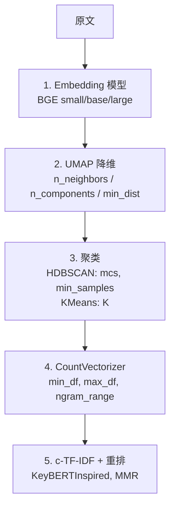
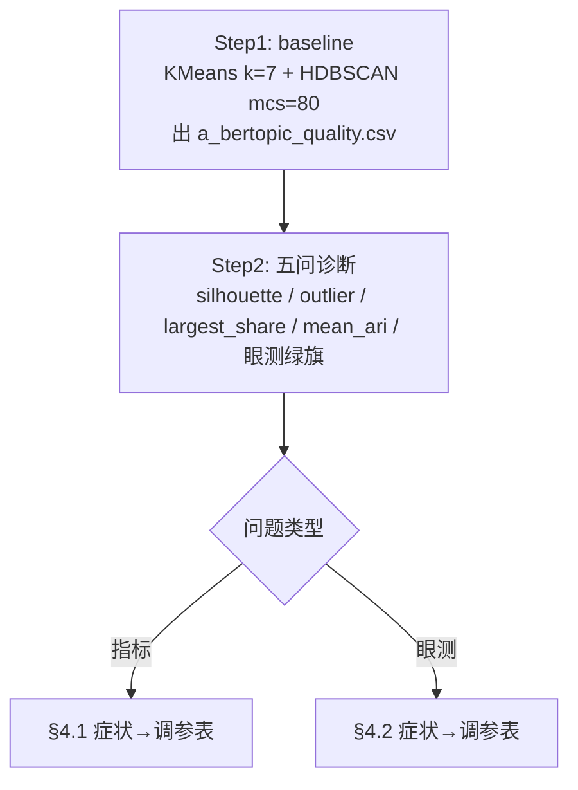

Part 1：先建立一套「判断质量」的眼力（最重要）

主题建模没有 ground truth，指标永远只是辅助。最终判断必须靠你的眼睛 + 研究问题。下面这套眼力分三层。

## 1.1 第一层眼力：5 分钟眼测（永远先做这一步）

打开 [`bert_kmeans_k7/topics.csv`](../../output/experiments/2026-05-09_topic_full_corpus_bge_base/bert_kmeans_k7/topics.csv) 与 [`samples.csv`](../../output/experiments/2026-05-09_topic_full_corpus_bge_base/bert_kmeans_k7/samples.csv)。每个主题问自己 4 个问题：

| 自检项 | 绿旗示例 | 红旗 / 黄旗示例 |
|--------|----------|-----------------|
| Q1：代表词的前 5 个，能不能连成一个话语主题？ | 「降温、冰块、加冰、发热、冷却」→ 散热 | 「机器人、有人、玩意、这个、那个」→ 杂物桶 |
| Q2：随机读 10 条样本，能不能用 1 句话总结？ | 都在嘲笑机器人摔倒姿势 | 前 5 条说 A、后 5 条说 B → 主题被错误合并 |
| Q3：代表词跟样本一致吗？ | 词说「外卖」，样本里也都在聊外卖职业 | 词说「外卖」，样本一半在聊「这玩意有啥用」→ 高频词主导，真实主题是「质疑」 |
| Q4：这个主题对你研究问题有意义吗？ | 「嘲讽 / 质疑 / 拟人化」直接相关 | 「降温、冰块」纯技术讨论 → 可剔除或合并 |

**经验法则**：4 个问题里 ≥ 3 个绿旗，主题成立；≤ 2 个绿旗，主题不可信。

## 1.2 第二层眼力：主题之间是不是真的不同

打开 `topics.csv`，横向对比两个主题的代表词重叠：

| 主题 A 代表词 | 主题 B 代表词 | 重叠情况 | 判断 |
|---------------|---------------|----------|------|
| 机器人 / 小机器人 / 人形 | 机器人 / 跑步 / 有人 | 「机器人」共享，其他词差异大 | 不同主题；「机器人」是高频词 |
| 摔倒 / 摔成 / 摔死 | 倒地 / 摔了 / 一跤 | 高度重叠 | 可能本应合并 |

**经验法则**：如果两个主题前 10 词重叠 ≥ 5 个，且代表评论也像，这两个主题应该合并——是 K 选大了的信号。

## 1.3 第三层眼力：主题是不是被某帖主导

这是 post_dominance 的非技术版。

打开 [`bert_kmeans_k7/by_post_id.csv`](../../output/experiments/2026-05-09_topic_full_corpus_bge_base/bert_kmeans_k7/by_post_id.csv)，对每个主题问：**该主题里占比最大的那个帖子，`share_within_post`（或同类列）是多少？**

| share（最大帖在该主题内的占比） | 含义 |
|--------------------------------|------|
| 小于 30% | 主题在多帖出现，更像真主题 |
| 30%–50% | 与少数帖子内容耦合 |
| 大于 50% | 主题基本被单帖主导，结构性弱 |

---

Part 2：定量指标——每一个的真实含义

打开 [`a_bertopic_quality.csv`](../../output/experiments/2026-05-09_topic_full_corpus_bge_base/a_bertopic_quality.csv) 对照看。

## 2.1 覆盖性指标

**outlier_rate（HDBSCAN 专属）**：被标成噪声（-1）的评论比例。

| 数值 | 解读 |
|------|------|
| 小于 15% | 模型很自信，几乎全部进簇 |
| 15%–35% | 较健康：该拒的拒了，簇内质量尚可 |
| 35%–50% | 可疑：大量无法归类，或 schema/参数过严 |
| 大于 50% | 模型基本失败 |

你的 mcs=50（约 47%）和 mcs=80（约 45%）都在偏可疑区间——若簇内 silhouette 仍高，取舍是「少而精」还是「多而杂」，由研究问题定。

**largest_share（最大簇占比）**：最大那个主题占全体的比例。

| 数值 | 解读 |
|------|------|
| 小于 30% | 分布较健康 |
| 30%–50% | 可能有「杂物桶」大簇 |
| 大于 50% | 坍塌：一簇独大 |

你的 KMeans k=7 约 22%；HDBSCAN mcs=200 约 91%（坍塌）。

## 2.2 几何指标（簇分得开不开）

**silhouette（轮廓系数）**，范围约 [-1, 1]：点是否更靠近本簇而非邻簇。

| 数值 | 解读 |
|------|------|
| 大于 0.5 | 簇分得开 |
| 0.3–0.5 | 中等；中文短文本常见，别期待 0.7+ |
| 小于 0.2 | 簇之间区别弱 |

⚠️ **陷阱**：HDBSCAN 的 silhouette 通常只算**被聚进去的点**，outlier 不参与。例如 mcs=50 时 silhouette 0.65 很亮，但可能对应约 47% 评论被扔掉——必须配 **outlier_rate** 一起看。

**dbcv（Density-Based Cluster Validation）**，范围约 [-1, 1]：密度结构是否合理，更贴 HDBSCAN。

| 数值 | 解读 |
|------|------|
| 大于 0.4 | 较好 |
| 0.2–0.4 | 可接受 |
| 小于 0.2 | 结构差 |

KMeans 没有 DBCV（非密度聚类）。

## 2.3 稳定性指标

**mean_ari（多 seed 一致性）**：换随机种子，聚类标签有多接近。

| 数值 | 解读 |
|------|------|
| 大于 0.95 | 很稳、可复现 |
| 0.8–0.95 | 可接受 |
| 小于 0.8 | 不稳，换 seed 结论可能变 |

你的 KMeans k=10 mean_ari ≈ 0.76 → K 可能偏大；k=7 约 0.995，较稳。

## 2.4 主题词质量指标（建议补算）

**coherence（主题一致性）**

- CV（UMass 类）：基于共现，常归一到 0–1，越高越好。
- NPMI：约 [-1, 1]，越高越好。

| CV 粗读 | 解读 |
|---------|------|
| 大于 0.55 | 词在语料里真的共现 |
| 0.4–0.55 | 中等 |
| 小于 0.4 | 词像凑数，可读性差 |

工具：gensim `CoherenceModel`；可接入 [`phase1/topic_modeling.py`](../../phase1/topic_modeling.py) 自动出表。

**topic_diversity（主题词多样性）**：Top-K 词里只在一个主题出现的比例。

| 数值 | 解读 |
|------|------|
| 大于 0.7 | 主题间词差异大 |
| 小于 0.5 | 多主题共享高频词，区分度低 |

## 2.5 研究专用指标（建议增加）

- **post_dominance**：每主题被**单帖**评论条数主导的程度（见 `phase1/topic_post_dominance.py`）。
- **status_specificity**：某主题在某 `robot_status`（或分层）下的占比 ÷ 该主题在全语料占比；大于 1 表示在该状态偏多，小于 1 偏少——可支撑「某状态下独有话语」的写法。

---

Part 3：调参手册——按「问题 → 参数」定位

## 3.1 调参的根本原则

> **调参之前必须先诊断。**  
> 不知道为什么主题不好就乱调 = 在迷雾里转圈。  
> 先看哪个指标差，再针对性调 = 工程行为。

一次只动一个参数；同时改多个，说不清是谁在起作用。

## 3.2 BERTopic 流程图（参数落点）

## 3.3 各参数详解（按「动了会怎样」）

### 第 1 层：Embedding model

| 参数 / 模型 | 选项 | 效果 | 何时换 |
|-------------|------|------|--------|
| BAAI/bge-small-zh-v1.5 | 小、512 维 | 快，冒烟 | 数据少于 500 条 |
| BAAI/bge-base-zh-v1.5 | 中、768 维 | 平衡 | **默认** |
| BAAI/bge-large-zh-v1.5 | 大、1024 维 | 更细语义，慢 | base 太粗且有算力 |
| text2vec-base-chinese | 中 | 老牌 | 对比用 |
| m3e-base | 中 | 偏中文社媒 | 网络词多时可试 |

换 embedding 影响最大，但要重编码全语料；建议其他项先稳住再换。

### 第 2 层：UMAP

| 参数 | 默认 | 调大 → | 调小 → |
|------|------|--------|--------|
| n_neighbors | 15 | 更全局、主题更粗 | 更局部、主题更细 |
| n_components | 5 | 保留更多维，HDBSCAN 可更细 | 压得更扁，主题更粗 |
| min_dist | 0.0 | 簇间更开、簇内更松 | 簇内更紧、易粘连 |

**典型组合**

| 目标 | 试 |
|------|-----|
| 更多主题（偏 open coding） | n_neighbors=10, n_components=10, min_dist=0.0 |
| 更宏观（偏 axial） | n_neighbors=50, n_components=5, min_dist=0.1 |
| 平衡（常见默认） | n_neighbors=15, n_components=5, min_dist=0.0 |

`random_state` 必须固定（如 42），否则不可复现。

### 第 3 层：HDBSCAN

| 参数 | 含义 |
|------|------|
| min_cluster_size | 少于此规模的簇不成簇 |
| min_samples | 核心点邻域密度阈值；常与 mcs 同值 |

**技巧（FAQ C6）**：`min_samples` **单独设小**（如 5）常能明显降 outlier。

| 配置 | 效果（量级） |
|------|----------------|
| mcs=50, min_samples=50 | outlier 可能很高（如 ~47%） |
| mcs=50, min_samples=5 | outlier 常可降到 ~25% 左右，主题数略增 |

可试 **mcs=80, min_samples=5**：偏 axial 粒度 + 降 outlier。

### 第 4 层：CountVectorizer（BERTopic 内）

| 参数 | 当前建议 | 说明 |
|------|----------|------|
| min_df | 1（配合 FAQ E1） | 与「按主题拼伪文档」一致 |
| max_df | 1.0 | 同上 |
| ngram_range | (1,1) 或试 (1,2) | (1,2) 利于「人形机器人」等长词进主题词 |
| stop_words | 项目停用词表 | 噪声词可补 [`corpus_noise_tokens.csv`](../../config/topic_modeling/corpus_noise_tokens.csv) |

### 第 5 层：Representation（主题词重排）

当前：`KeyBERTInspired()` + `MaximalMarginalRelevance(0.3)`。

| 参数 / 扩展 | 效果 |
|-------------|------|
| MMR diversity=0.5 | 词更多样，可能偏离簇心 |
| PartOfSpeech（如 zh） | 只要名/动等 |
| LLM representation | 自动命名，贵但可读 |

---

Part 4：调参 workflow

## 4.1 指标差 → 怎么调

| 症状 | 诊断 | 怎么调 |
|------|------|--------|
| outlier_rate 大于 40% | HDBSCAN 过严 | `min_samples` 单独减小；或改 KMeans |
| largest_share 大于 50% | 杂物桶 / 大簇 | 调小 mcs；或增大 K；或调 UMAP 看更细 |
| silhouette 小于 0.2 | 簇分不清 | UMAP `min_dist`↑；或更强 embedding |
| mean_ari 小于 0.85 | 不稳定 | K 过大则减小 K；固定 random_state |
| n_topics = 2 | 坍塌 | mcs↓、n_neighbors↓、检查 embedding 是否异常 |

## 4.2 眼测差 → 怎么调

| 症状 | 怎么调 |
|------|--------|
| 主题词碎成单字（机器/器人） | 确认 jieba 生效；`ngram_range` (1,2) |
| 多主题代表词大量重叠 | K 过大；减小 K 或事后合并主题 |
| 一主题样本明显两件事 | K 过小；增大 K 或子集单独建模 |
| 所有主题都很泛 | embedding 区分弱；换大模型或加领域词 |
| 与 pre-registration 完全对不上 | 多半是数据/抽样，不是拧一个参数能救 |

## 4.3 何时停手

1. 指标进入合理区（如 silhouette 大于 0.35、largest_share 小于 30%、mean_ari 大于 0.95）。
2. 眼测多数主题绿旗。
3. 连续 3 次调参，指标在 ±10% 内抖——接近模型上限。
4. 已覆盖研究问题需要的话语类型（指标不完美也可收束）。

---

Part 5：用你自己的数据练手

## 练习 1：诊断现有 KMeans k=7（约 30 分钟）

### 1. 「主题词都是碎双词」其实不成立

见 [`bert_kmeans_k7/topics.csv`](../../output/experiments/2026-05-09_topic_full_corpus_bge_base/bert_kmeans_k7/topics.csv)：

| Topic | Top terms（摘要） | 解读 |
|-------|-------------------|------|
| 0 | 机器人 / 小机器人 / 人形机器人 / 机器人马拉松 | 长词正常 |
| 5 | 降温 / 冰块 / 加冰 / 发热 / 冷却 / 散热 | 语义清晰 |
| 6 | 遥控 / 遥控器 / 遥控车 / 失控 / 操控 | 一族 |
| 4 | 轮子 / 轮胎 / 赛车 / 汽车 / 轱辘 | 一族 |
| 3 | 外卖 / 是不是 / 没用 / 干嘛 / 玩意 | 语义混（质疑 + 职业） |
| 1 | 跑得快 / 跑不动 / 挺快 / 赛跑 | 一族 |
| 2 | 可爱 / 好笑 / 好玩 / 喜欢 | 情感族 |

碎双词更多出现在 **HDBSCAN mcs=30/50** 那种极多小簇、高 outlier 的设置里，是**过度切分**，不是分词单独造成的。

### 2. 质量信号：a_bertopic_quality.csv

[`a_bertopic_quality.csv`](../../output/experiments/2026-05-09_topic_full_corpus_bge_base/a_bertopic_quality.csv) 已含 silhouette / DBCV / mean_ari / largest_share：

| 配置 | n_topics | silhouette | DBCV | mean_ari | largest_share | 解读 |
|------|----------|------------|------|----------|---------------|------|
| HDBSCAN mcs=30 | 97 | 0.62 | 0.31 | 1.00 | 6% | 太碎 |
| HDBSCAN mcs=50 | 58 | 0.65 | 0.28 | 1.00 | 8% | 几何好看但 ~47% outlier |
| HDBSCAN mcs=80 | 29 | 0.58 | 0.25 | 1.00 | 16% | 较平衡 |
| HDBSCAN mcs=100 | 20 | 0.35 | 0.10 | 1.00 | 44% | 大簇主导 |
| HDBSCAN mcs=200 | 2 | 0.44 | 0.29 | 1.00 | 91% | 坍塌 |
| KMeans k=5 | 5 | 0.34 | — | 0.99 | 28% | OK |
| KMeans k=7 | 7 | 0.38 | — | 0.995 | 22% | **当前主推** |
| KMeans k=10 | 10 | 0.37 | — | 0.76 | 21% | mean_ari 掉，不稳 |

HDBSCAN 的 silhouette 常与「大量点当 outlier」并存，必须结合 outlier 比例解读。

### 3. 常见调参建议值不值得做

| 参数 | 当前 / 动作 | 能解决「碎双词」吗 | 对「质量未知」有帮助吗 |
|------|-------------|--------------------|-------------------------|
| UMAP n_neighbors | 默认 15 → 调到 30/50/100 | 否（主题词流水线不因此变「碎」） | 能换宏观/局部结构 |
| UMAP n_components | 5 → 10/15 | 否 | 有限 |
| UMAP min_dist | 0.0 → 0.1/0.2 | 否 | 能影响簇分离 |
| HDBSCAN mcs | 已扫 30–200 | 已扫过 | 已知 |
| HDBSCAN min_samples | 与 mcs 解绑，如 5 | 间接（簇规模更合理） | **是**，FAQ 推荐 |

**结论**：对你当前痛点，**优先试 min_samples 解绑**；单靠拧 UMAP 对「词可读性」帮助有限。

### 4. 建议下一步（ROI）

1. **Topic coherence（CV / NPMI）**：gensim，补「词面共现」质量。
2. **代表评论近读表**：每主题扩到 20–30 条（可按到簇心距离排序），便于 5–10 分钟速读判定绿旗。
3. 与 **post_dominance / 点赞集中度** 对照，识别「假主题」。

---

*文档内路径均相对于本文件：`idea/learn/bertopic扫盲和调参.md`。*
