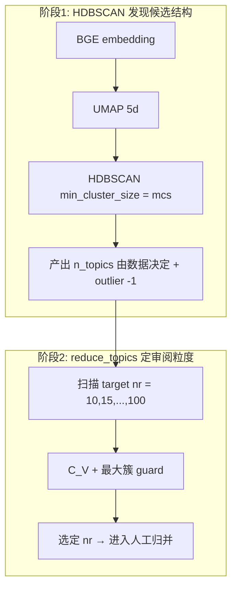

# L1/L2 分层 Topic Discovery（详细方案）

## 0. 目录与 run 结构

**父 run**（不变）：`output/experiments/2026-05-27_topic_merged_bge_hdbscan_sensitivity/`

| 路径 | 角色 |
|------|------|
| [`topic_discovery_review/`](output/experiments/2026-05-27_topic_merged_bge_hdbscan_sensitivity/topic_discovery_review/) | **Pooled**（26,811 评论；已完成；降级为敏感性/附录） |
| **`topic_discovery_l1/`** | **一级评论**（N≈15,901）；**必跑**；主分析优先 |
| **`topic_discovery_l2/`** | **二级回复**（N≈10,910）；**必跑**；与 L1 并列、独立选参 |

**交付标准**：L1 与 L2 **各有一套完整产物**（与 pooled 的 `topic_discovery_review/` 同级），包括但不限于：
`corpus_freeze.json`、`hdbscan_candidate_summary.csv`、`topic_number_cv_curve.*`、`final_model_selection.json`、`final_model/`、`coder1/2_sheet_final_nr*.csv`、`topic_comment_samples_final_nr*.csv`、`topic_coding_codebook.md`、`sensitivity/`、`output_manifest.csv`。

缺任一层视为流程未完成。

每层目录 **镜像** pooled 的 [`topic_discovery_review.md`](writing/topic_discovery_review.md) 结构：

```
topic_discovery_l1/
  corpus_freeze.json
  hdbscan_candidate_summary.csv
  topic_number_cv_curve.csv / .png
  topic_number_selection_notes.md
  final_model_selection.json
  final_model/{topics_final,doc_topics_final,model_meta}.json
  topic_number_scan_mcs{K}/          # 中间产物，可归档
  coder1_sheet_final_nr{K}.csv
  coder2_sheet_final_nr{K}.csv
  topic_comment_samples_final_nr{K}.csv
  topic_coding_codebook.md
  sensitivity/
  ...
```

共享输入（不切 run）：
- [`shared_analyzable_corpus.csv`](output/experiments/2026-05-27_topic_merged_bge_hdbscan_sensitivity/shared_analyzable_corpus.csv) — 按 `comment_level` 过滤
- 可选：父 run 下 `embeddings.npy`（全库 encode 一次后切片，省时间）

**文档**：[`writing/topic_discovery_review.md`](writing/topic_discovery_review.md) 扩为「总流程 + 三层对照表 + 参数说明 + 列释义附录」。

---

## 1. HDBSCAN 要不要「定几个类别」？

**不需要、也不应该在 HDBSCAN 阶段预设最终 topic 数 K。**

本流程是 **两阶段** 定粒度（与 zmae015 / 现有 pooled 一致）：



| 参数 | 控制什么 | 是否「定类别数」 |
|------|----------|------------------|
| **`mcs`（min_cluster_size）** | 多「密」才算一个簇；越大 → topic 越少、簇越大 | **否**；只定密度门槛 |
| **`min_samples`** | 核心点邻域（默认常 = mcs） | 否 |
| **`reduce_topics(nr)`** | 把已有 topic **合并**到目标数 | **是（目标 K）**，但是后验合并，不是 HDBSCAN 的 K |
| **人工 domain** | 84 行 machine topic → 更少的 meta-theme | 社会科学主题，另一层 |

**Pooled 已做过的决策（L1/L2 需重验，不可照搬）**：

- mcs 候选：**30 / 50 / 80 / 100**（见 [`hdbscan_candidate_summary.csv`](output/experiments/2026-05-27_topic_merged_bge_hdbscan_sensitivity/topic_discovery_review/hdbscan_candidate_summary.csv)）
- pooled 选 **mcs=50**（88 topics，最大簇 7.6%）；拒绝 mcs=80（mega-cluster ~39%）
- C_V 扫描 **nr=10–100 step 5**；拒绝 blind max-C_V（nr=50）；选 **nr=85** → 84 topics

**L1 与 L2 均必跑**（顺序：先 L1 后 L2；L2 不依赖 L1 质检通过，但实现/调试时建议 L1 先跑通再跑 L2）：

1. 重跑 mcs 表（30/50/80/100）
2. 重跑 C_V 曲线（nr=10–100 step 5）
3. **独立**写 `topic_number_selection_notes.md`（不得写死 nr=85）
4. 生成该层 **完整审阅材料**（coder 表 + 10 评论/topic）

**L2 预期**：更短文本 → outlier 率可能 **高于** pooled 44%；可能需 **更小 mcs**（如 30）或接受更高 outlier——仍须跑完并报告，不得跳过 L2。

---

## 2. 每层完整机器流程（对齐 topic_discovery_review.md）

### 阶段 0：冻结子语料

- 过滤：`comment_level == 1` 或 `2`
- 写出 `corpus_freeze.json`：`n_shared`、`comment_level`、SHA、剔除规则引用
- L1 N≈15,901；L2 N≈10,910

### 阶段 1：Embedding + UMAP + HDBSCAN 候选

**实现选项（推荐 B）**：

- **A**：每层单独 BGE encode（简单，慢 ~2×）
- **B**：父 run 一次 encode 26,811 → 按 `comment_id` 切 L1/L2 embedding → **每层单独 UMAP + HDBSCAN**（快且正确）

对 **每个 mcs ∈ {30,50,80,100}**（L2 可加 20）：

- fit BERTopic+HDBSCAN（`low_memory=True`，`device=cpu` 或 `mps`）
- 记录：`n_topics`、`raw_outlier_rate`、`largest_share_valid`
- 保存 **`bert_hdbscan_mcs{mcs}/`** 至 **该层目录**（或仅保存选中的 mcs 以省磁盘）

**选 base_mcs 规则**（与 pooled 相同逻辑）：

- 优先：最大簇占比低（避免 mega-cluster）
- 其次：topic 数可人工审阅（约 40–150 视层级而定）
- 报告 outlier 率，不隐藏

### 阶段 2：Topic-number selection

- 加载 **该层** `bert_hdbscan_mcs{base_mcs}/model`
- 对每个 `nr ∈ {10,15,…,100}`：`reduce_topics(docs, nr_topics=nr)`
- 计算 **C_V**（gensim + jieba；过滤 OOV 词）
- 结构 guard：**largest_share_valid ≤ 0.12**，topic 数在可审阅范围
- 输出：`topic_number_cv_curve.csv/.png`、`final_model_selection.json`
- 复制选中 nr → `final_model/`

### 阶段 3：审阅材料

- `build_enhanced_topic_review_table`（10 条评论 / topic）
- **L1/L2 表内不再需 `level1_share`/`level2_share`**（单层内恒定）；可保留 `n_posts_raw`、`top_post_share_raw`
- 产物：`coder1/2_sheet_final_nr{K}.csv`、`topic_comment_samples_final_nr{K}.csv`

### 阶段 4–6：人工标注 → agreement → backfill

- 与 pooled 相同；**两套独立 codebook / domain 列表**（允许 L1/L2 domain 名称事后对照，不强制同一套）
- 类型比较：**各层内** `final_domain × robot_status`（评论加权 + 帖子加权）

---

## 3. 代码改动要点

[`phase1/topic_discovery.py`](phase1/topic_discovery.py)：

```python
@dataclass
class TopicDiscoveryConfig:
    comment_level: int | None = None  # 1, 2, or None=pooled
    review_subdir: str = "topic_discovery_review"  # or topic_discovery_l1/l2
```

[`phase1/run_topic_discovery.py`](phase1/run_topic_discovery.py)：

```bash
# 两层均必跑（机器全流程）；建议顺序执行
./.venv/bin/python -m phase1.run_topic_discovery --comment-level 1 --review-dir topic_discovery_l1 --step all
./.venv/bin/python -m phase1.run_topic_discovery --comment-level 2 --review-dir topic_discovery_l2 --step all

# 或封装为
./.venv/bin/python -m phase1.run_topic_discovery --run-both-levels --step all
```

可选：从父 run 读 `embeddings.npy` + 子集 index，跳过 re-encode。

**不重跑**：phase1 全套 LDA/NMF/7 个 mcs 的 [`topic_modeling.py`](phase1/topic_modeling.py) 主流程（除非要写方法对比）。

---

## 4. 更新 writing/topic_discovery_review.md（内容大纲）

在现有 298 行基础上 **重构为**：

1. **研究设计**：为何 L1/L2 分层（语用差异、pooled 混杂）；pooled 降为敏感性  
2. **三层对照表**：pooled / L1 / L2 的 N、选定 mcs、选定 nr、topic 数、outlier、目录路径  
3. **参数说明专节**（回答「要不要定类别」）：
   - HDBSCAN：`mcs` 不是 K；outlier 含义
   - `reduce_topics(nr)`：目标 K；与 mcs 区别
   - 人工 domain：第三层归并  
4. **流程图**：每层独立走 0–8 阶段（mermaid）  
5. **coder 表列释义**（从文末草稿移入正式 **附录 A**）：
   - `topic_id` … `sample_comments_10` … `domain/label/notes`
   - `representative_docs` vs `sample_comments_10` 差异  
6. **标注指南**：mixed/unclear、domain vs label vs notes  
7. **目录索引**：关键文件 vs 可归档（`topic_number_scan_*`、`hdbscan_mcs50_*` 原型）  
8. **状态 checklist**：
   - [x] pooled 机器 + 审阅材料
   - [ ] **L1 机器全流程（必跑）**
   - [ ] **L2 机器全流程（必跑）**
   - [ ] L1/L2 人工标注（各层独立 coder 表）
   - [ ] 文档三层对照表填齐选定 mcs/nr

删除文末粘贴的重复表格片段（274–298 行草稿），并入附录。

---

## 5. 本机可行性（M4 24GB）

不变：每层 **~25–60 min**（encode 若切片则更短）；L1+L2 **~1–2 h** 机器时间；人工标注为主瓶颈。

---

## 6. 执行顺序（L1 + L2 均必跑）

1. 扩展 pipeline + CLI（含 `--run-both-levels` 或等价顺序调用）  
2. 生成/恢复父 run `embeddings.npy`（全库一次 encode → L1/L2 切片）  
3. **跑 L1 机器全流程** → `topic_discovery_l1/` 全套产物 + `output_manifest.csv`  
4. **跑 L2 机器全流程** → `topic_discovery_l2/` 全套产物 + `output_manifest.csv`  
5. 更新 `topic_discovery_review.md`（三层对照表填入 L1/L2 实际 mcs、nr、topic 数、outlier）与 `method&data.md`  
6. pooled 84 行标注 **暂停**；pooled 仅作敏感性附录  

**验收**：`topic_discovery_l1/` 与 `topic_discovery_l2/` 目录均存在且 manifest 关键文件 `exists=True`。

---

## 7. 论文叙事（一句）

一级评论与二级回复语用功能不同，故 **分别** 进行 HDBSCAN 候选发现、C_V 定 nr 与人工 domain 归并；全量 pooled 模型仅报告为敏感性分析。

---

## 8. 实习生能否跑通？——上下文缺口审查

### 8.1 当前代码 vs 计划（必读）

| 能力 | 现状 | 实习生能否跑 |
|------|------|-------------|
| pooled：`freeze` → `select` → `review` | [`topic_discovery.py`](phase1/topic_discovery.py) 已实现；**依赖** 父 run 已有 `bert_hdbscan_mcs50/model/`（由 [`topic_modeling.py`](phase1/topic_modeling.py) 预先产出） | **能**（若 run 目录已有 BERTopic 产物） |
| pooled：`--step all` 含 HDBSCAN fit | **否**；`all` = freeze+select+review+…，**不含** encode/UMAP/HDBSCAN | 新人易误以为一条命令从零跑通 |
| pooled：人工标注 → agreement → backfill | CLI 已有 `--step agreement/backfill` | **能**（按 SOP） |
| **L1/L2 分层全流程** | CLI **尚无** `--comment-level` / `--run-both-levels`；**尚无** 分层 fit HDBSCAN | **不能**，需先完成 §3 代码改动 |
| L1/L2：`select` 直接跑 | 会读 pooled 的 `bert_hdbscan_mcs50`，**结果错误** | **禁止**在实现前对 L1/L2 目录跑现有 CLI |

**结论**：计划对方法论足够，但对实习生 **尚缺可执行 Runbook + L1/L2 实现**；需在交付前补 §8.2 文档 + §3 代码。

### 8.2 必须在文档中补充的「实习生 Runbook」内容

建议新增 [`writing/topic_discovery_intern_runbook.md`](writing/topic_discovery_intern_runbook.md)（或写入 [`topic_discovery_review.md`](writing/topic_discovery_review.md) 最前 §0），包含：

#### A. 环境与前置（一次性）

```bash
cd /path/to/2604-robotic_failure_research
python3 -m venv .venv
./.venv/bin/pip install -r requirements.txt
# 首次需联网下载 BGE；或确认 ~/.cache/huggingface 已有 BAAI/bge-base-zh-v1.5
```

**Pooled 从零复现的前置（当前代码）**：必须先有 `output/experiments/2026-05-27_topic_merged_bge_hdbscan_sensitivity/bert_hdbscan_mcs{30,50,80,100}/`（含 `model/`、`doc_topics.csv`）。若目录缺失，需先跑：

```bash
PYTHONUNBUFFERED=1 ./.venv/bin/python -m phase1.topic_modeling \
  --run-id 2026-05-27_topic_merged_bge_hdbscan_sensitivity \
  --device cpu \
  --hdbscan-min-cluster-sizes 30 50 80 100
```

（见 [`phase1/RUNBOOK.md`](phase1/RUNBOOK.md) §3；**该 RUNBOOK 目前未写 topic_discovery 一节**，需补。）

- **必须用** `./.venv/bin/python`，勿用系统 Python（曾出现 numpy/pandas ABI 错误）
- 从**仓库根目录**运行所有命令
- 无需 GPU；M4 Mac `device=cpu` 即可（可选 `mps` 仅加速 encode）
- 长任务请接电源

#### B. 三条轨道：用哪张表、哪个目录

| 轨道 | 目录 | coder 表 | 状态 |
|------|------|----------|------|
| Pooled（敏感性） | `topic_discovery_review/` | `coder*_sheet_final_nr85.csv` | 机器已完成；**勿作为主标注** |
| **L1 一级** | `topic_discovery_l1/` | `coder*_sheet_final_nr*.csv` | 待机器跑完 |
| **L2 二级** | `topic_discovery_l2/` | 同上 | 待机器跑完 |

**勿用**：`hdbscan_mcs50_*` 原型表、`topic_discovery_review/` 里未带 `_l1/_l2` 的旧路径。

#### C. 机器流程逐步（L1/L2 实现后；pooled 作参照）

**顺序固定**（每层独立）：

| 步 | CLI `--step` | 做什么 | 成功标志 |
|----|--------------|--------|----------|
| 0 | `freeze` | 写 `corpus_freeze.json` | 含 `comment_level`、SHA、N |
| 1 | `fit`（**待实现**）或 phase1 子命令 | UMAP+HDBSCAN，mcs=30/50/80/100 → `hdbscan_candidate_summary.csv` + `bert_hdbscan_mcs*/` | 表中有 4 行 mcs |
| 2 | （人工） | 读 mcs 表选 `base_mcs`，写入 config 或 `--base-mcs` | 最大簇占比不过高 |
| 3 | `select` | C_V 扫描 nr=10–100 → `topic_number_cv_curve.*`、`final_model_selection.json` | 有选定 nr，非硬编码 85 |
| 4 | `review` | coder 表 + `topic_comment_samples_*.csv` | 行数 = 该层 topic 数 |
| 5 | `sensitivity` + `validate` + `document` | 敏感性表、manifest | `output_manifest.csv` 关键项 `exists=True` |

**L1 → L2 均跑一遍**；第二层命令仅改 `--comment-level` 与 `--review-dir`。

#### D. 人工标注 SOP（每层独立）

1. 打开 **`topic_comment_samples_final_nr{K}.csv`**（Excel 按 `topic_id` 筛选）+ **`coder1_sheet_final_nr{K}.csv`**
2. 只填 **`domain` / `label` / `notes`**；**不要改** `topic_id`、机器列
3. 读证据顺序：`top_terms` → `sample_comments_10` → `representative_docs`（辅助）
4. 允许 `mixed/unclear`；notes 必填子类型说明
5. 另存 **`coder1_sheet_final_nr{K}_done.csv`**（勿覆盖空白模板）
6. Coder 2 独立重复 → `coder2_*_done.csv`
7. `./.venv/bin/python -m phase1.run_topic_discovery --review-dir topic_discovery_l1 --step agreement`
8. 仲裁填 **`final_topic_map.csv`** → `--step backfill`

**domain vs label vs notes**：见 Runbook 附录（或 [`topic_coding_codebook.md`](output/experiments/2026-05-27_topic_merged_bge_hdbscan_sensitivity/topic_discovery_review/topic_coding_codebook.md)）。

#### E. 验收清单（交付负责人用）

- [ ] `topic_discovery_l1/output_manifest.csv` 关键文件全部 `exists=True`
- [ ] `topic_discovery_l2/output_manifest.csv` 同上
- [ ] 两层 `topic_number_selection_notes.md` 均解释 **为何** 选该 mcs/nr（非复制 pooled）
- [ ] `final_model/doc_topics_final.csv` 行数 = 该层 N；含 `topic_reduced`
- [ ] coder 表行数 = 该层 topic 数；**不是** 2530 行（那是 CSV 换行假象，用 pandas `len` 验证）
- [ ] 未修改 `shared_analyzable_corpus.csv`、plan 文件、已冻结 pooled 产物

#### F. 常见踩坑

| 现象 | 原因 | 处理 |
|------|------|------|
| `final_nr unknown` | 未先跑 `select` | 先 `--step select` |
| `CoherenceModel` ValueError | gensim 词表问题 | 已在代码中过滤 OOV；更新到最新 `topic_discovery.py` |
| C_V scan 很慢 | 19 次 load BERTopic | 正常 ~1min；勿中断 |
| Excel 打开 coder 表行数爆炸 | 单元格内换行 | 用 pandas 读；或只看 `topic_comment_samples` 长表 |
| L1/L2 用了 nr=85 | 抄 pooled 参数 | **禁止**；读该层 `final_model_selection.json` |
| `select` 无 `bert_hdbscan_mcs50` | 未跑 fit | 先跑 fit（§3 待实现） |

#### G. 实现交付后的一键命令（目标态）

```bash
# 仓库根目录
./.venv/bin/python -m phase1.run_topic_discovery --run-both-levels --step all
# 等价于：
./.venv/bin/python -m phase1.run_topic_discovery --comment-level 1 --review-dir topic_discovery_l1 --step all
./.venv/bin/python -m phase1.run_topic_discovery --comment-level 2 --review-dir topic_discovery_l2 --step all
```

人工阶段完成后（**每层各跑**）：

```bash
./.venv/bin/python -m phase1.run_topic_discovery --comment-level 1 --review-dir topic_discovery_l1 --step agreement
./.venv/bin/python -m phase1.run_topic_discovery --comment-level 1 --review-dir topic_discovery_l1 --step backfill
# L2 同理
```

### 8.3 文档同步清单（实现时一并完成）

| 文件 | 需更新内容 |
|------|------------|
| [`writing/topic_discovery_review.md`](writing/topic_discovery_review.md) | §0 实习生入口、三层对照、L1/L2 目录、附录列释义、去掉 pooled-only 表述 |
| [`writing/topic_discovery_intern_runbook.md`](writing/topic_discovery_intern_runbook.md) | **新建**；§8.2 全文 + 截图级步骤 |
| [`topic_discovery_review/REPRO.md`](output/experiments/2026-05-27_topic_merged_bge_hdbscan_sensitivity/topic_discovery_review/REPRO.md) | 复制模板到 `topic_discovery_l1/REPRO.md`、`l2/REPRO.md` |
| [`phase1/RUNBOOK.md`](phase1/RUNBOOK.md) | 增加 topic_discovery 一节 + L1/L2 说明 |
| 各层 `topic_coding_codebook.md` | 注明 `comment_level`、该层选定 nr |

### 8.4 对「足够上下文」的判断

| 维度 | 是否足够 | 补什么 |
|------|----------|--------|
| 方法论（mcs/nr/人工层） | 足够 | 已在本计划 §1–2 |
| pooled 可复现命令 | 基本够 | REPRO.md 已有 |
| **L1/L2 可执行命令** | **不够** | §3 实现 + §8.2 Runbook |
| 人工标注 SOP | 分散 | 集中到 intern_runbook + codebook |
| 验收标准 | 不够明确 | §8.2 E + output_manifest |
| 禁止事项 | 不够 | §8.2 B、F |
| 与 LLM 标注项目边界 | 缺失 | Runbook 注明：topic domain 归并 ≠ `human_label_llm` emotion/object |
| **Pooled 前置 topic_modeling** | REPRO 未写 | Runbook §A：无 `bert_hdbscan_mcs*` 时先跑 topic_modeling |
| **phase1/RUNBOOK.md 无 topic_discovery** | 缺口 | 增加一节链到 intern_runbook |

**给实习生的最短路径（实现完成后）**：

1. 读 `topic_discovery_intern_runbook.md`  
2. 跑 `--run-both-levels --step all`  
3. 检查两层 `output_manifest.csv`  
4. 按 L1 coder 表标注 → agreement → backfill  
5. 再 L2 重复  
6. pooled 仅附录对照，不主标  

