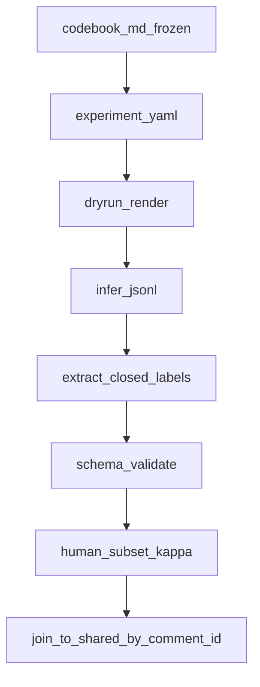

# Codebook 驱动 LLM 打标管线（设计文档）

> **状态**：设计稿（2026-09-09）。本轮**不写代码、不跑 API**。  
> **姊妹文档**（无监督主题发现）：[topic_modeling_upgrade.md](topic_modeling_upgrade.md)。  
> **实验规范参照**：本机 [relic3/relic_3.0_test/experiments/README.md](/Users/yilin/Desktop/project/relic3/relic_3.0_test/experiments/README.md)、[scripts/pipeline/README.md](/Users/yilin/Desktop/project/relic3/relic_3.0_test/scripts/pipeline/README.md)。  
> **码本真源**：[data/clean/label_codebook_llm.md](../data/clean/label_codebook_llm.md)。

## 0. 定位：编码，不是发现

| | BERTopic discovery | Codebook LLM（本文） |
|--|-------------------|----------------------|
| 问什么 | 评论里有哪些反复出现的语义邻域？ | 这条评论的立场/形象/情感极性/四维评价是什么？ |
| 类目 | 数据驱动簇 → 人工 domain | **事先封闭**的 codebook |
| 论文层 | 第二层「人们在说什么」（候选地图） | 立场/理由测量；可支撑 RQ1–3 |
| 与簇关系 | 主路径 | 可事后交叉 tabulate（domain × stance），**禁止**当 HDBSCAN 监督 |

---

## 1. 封闭码本（不可开放生成）

与 [label_codebook_llm.md](../data/clean/label_codebook_llm.md) 及 [tools/label_comments_llm.py](../tools/label_comments_llm.py) 一致。

### 1.1 `llm_figure_code`（9 类 + other）

| code | 中文参考 | 选用线索 |
|------|----------|----------|
| `competitor` | 竞争者/被超越者 | 比速度、比人类、胜负 |
| `threat` | 威胁/不安 | 失业、取代、恐怖谷 |
| `pet_cute` | 可爱宠物/孩童式 | 萌、可怜、想养 |
| `tool` | 工具/道具 | 遥控、演示、技术展品 |
| `patient` | 照护/救助对象 | 摔倒、失败、加油救治 |
| `fraud_fake` | 造假/噱头 | 摆拍、营销剧本 |
| `spectacle` | 奇观/节目 | 看热闹、玩梗 |
| `personified_peer` | 拟人同伴 | 当人/同事/选手对话 |
| `other` | 其他 | 以上不贴切；**必须**写 `figure_label`（≤20 字） |

### 1.2 `llm_stance`（3 类）

| 值 | 定义 |
|----|------|
| `支持` | 肯定能力、进步、可爱、有意义、辩护 |
| `反对` | 嘲讽、否定、质疑造假、排斥、恐惧 |
| `中立` | 陈述、提问、调侃难判；**必须**写 reason |

### 1.3 `llm_emotion_valence`（4 类）

| 值 | 定义 |
|----|------|
| `positive` | 整体积极（喜爱、兴奋、赞赏） |
| `negative` | 整体消极（厌恶、恐惧、愤怒） |
| `mixed` | 正负并存或转折 |
| `neutral` | 无明显情感倾向 |

`llm_emotion` 为开放用词（最贴切情感词/短语）；`llm_emotion_valence` 为上述封闭四选一。

### 1.4 `llm_d1`–`llm_d4`（各 Pos / Neg / N/A）

| 维 | 问什么 |
|----|--------|
| D1 Technical Capability | 速度、稳定性、工程 |
| D2 Affective Engagement | 可爱、好笑、可怜、喜爱、厌恶 |
| D3 Societal Value | 科技进步、意义、浪费、就业、伦理 |
| D4 Human Impact | 人类地位、替代、威胁、照护 |

各维独立；未涉及 = `N/A`。

### 1.5 解析与失败

- 输出 **仅 JSON**；schema 外键拒绝。  
- `parse_ok=false` 时 **不**静默填默认类。  
- `other` / `中立` **必须**有 reason 字段。

### 1.6 Codebook 文档规范（§7.4）

[src: data/clean/label_codebook_llm.md](../data/clean/label_codebook_llm.md) 实施时每类须补：

| 要素 | 要求 |
|------|------|
| **定义** | 与上表一致的可操作定义 |
| **正例** | 1–2 条真实评论片段 + 为何选该类 |
| **反例** | 易混邻类 + 为何不选 |
| **边界** | 何时 `other`、何时 `N/A`、与邻类分界 |

版本冻结：

- `codebook_id`：如 `label_codebook_llm_v20260519`（语义版本，写在 md YAML front matter 或首段）  
- `codebook_sha256`：文件内容哈希 → 写入 run [`config.json`](#33-configjson-冻结字段)  
- **改码本 = 新 `codebook_id` + 新 `prompt_version` + 新 yaml**；旧 run 目录只读、不可覆盖

---

## 2. 与现有两套代码的关系（§7.1）

两套实现服务**不同研究问题**，不可混为同一 prompt；生产 codebook 打标须统一到 relic 式 `output/experiments/`。

### 2.1 `human_label_llm` vs `label_comments_llm.py` 对照

| 维度 | [human_label_llm/](../human_label_llm/) | [tools/label_comments_llm.py](../tools/label_comments_llm.py) | **目标（relic 式）** |
|------|----------------------------------------|--------------------------------------------------------------|---------------------|
| 研究问题 | 评论**评估对象**（object 七类）与**情感**（emotion 七类） | 机器人**形象**（9 类）、**立场**（3 类）、**情感极性**、**D1–D4** | 仅后者；object/emotion 可并存**独立 yaml** |
| 类目体系 | 开放生成 label_en + 映射 label_cn | **封闭** codebook（`FIGURE_CODES` / `STANCES` / `VALENCES` / `POLARITIES`） | 封闭校验 + schema 外拒绝 |
| 启动入口 | yaml + `run_experiment.py dryrun\|infer\|compare` | CLI `--input-csv` / `--limit`；**无** yaml | **yaml 唯一入口**（类比 [relic `run_experiment.py`](/Users/yilin/Desktop/project/relic3/relic_3.0_test/scripts/pipeline/run_experiment.py)） |
| Prompt | 外置 `prompt/*.md` + front matter `id`/`version` | **内嵌** `SYSTEM_PROMPT` 字符串 | 外置 + `prompt_version` 注册表 |
| 输入文本 | 默认 `content`（金标小样本 CSV） | 金标 `manual_label_l1_30perpost.csv` | **shared 全库**；主列 **`content`**（非 `content_en`） |
| 输出目录 | `human_label_llm/output/{run_id}/` | `data/clean/*_llm.csv` + `label_checkpoint.jsonl` | [`output/experiments/<name>_<timestamp>/`](../output/experiments/) + [registry.csv](../output/experiments/registry.csv) |
| `config.json` 冻结 | 仅 `run.yaml` 快照；**无** input/codebook SHA | **无** | yaml + input SHA + codebook SHA + prompt_version |
| jsonl 续跑 | `log.jsonl`；**无** prompt_version 跳过语义 | `label_checkpoint.jsonl` 按 id；**无** version 校验 | relic 语义：`status=ok` + `prompt_version` 一致 → 跳过（见 §3.6） |
| dryrun | 填槽 + 渲染 prompt（fail-fast） | **无** | 缺列 / codebook 不一致 → 立即报错 |
| 人核 | `compare` → κ、macro-F1、`eval_gap_by_class.csv` | **无** | 分层 export → 填 `human_*` → merge（§3.9；[relic human_eval.md](/Users/yilin/Desktop/project/relic3/relic_3.0_test/doc/schema/human_eval.md)） |
| API 密钥 | 读 `human_label_llm/.env` → `ROOT/.env` 链 | **写死** [relic3 `.env`](/Users/yilin/Desktop/project/relic3/relic_3.0_test/) 路径 | yaml `runtime.env_file` 可配置 |
| 温度 | `0.0`（[_defaults.yaml](../human_label_llm/experiment/_defaults.yaml)） | `0.0` | **0.0** 主分析 |
| 任务拆分 | object / emotion **分 prompt** | **一 JSON 全字段** 单次调用 | stance / figure / dims **三 run**（§4.2） |

### 2.2 组件升级方向

| 组件 | 升级方向 |
|------|----------|
| [human_label_llm/](../human_label_llm/) | **保留** `compare` 与 dryrun 填槽逻辑；扩展 infer/extract 支持 codebook schema 与 relic 目录 |
| [tools/label_comments_llm.py](../tools/label_comments_llm.py) | schema **保留**；编排迁入 yaml runner；标 **legacy** 或 thin wrapper |
| [human_label_llm/experiment/_defaults.yaml](../human_label_llm/experiment/_defaults.yaml) | `model_catalog` / concurrency 被 `codebook_experiments/_defaults.yaml` 继承 |
| 产物目录 | 统一 `output/experiments/<name>_<timestamp>/`（对齐 [relic `output/experiment_<name>_<timestamp>/`](/Users/yilin/Desktop/project/relic3/relic_3.0_test/scripts/pipeline/README.md)） |

**目标**：生产 codebook 标注走 **relic 式实验目录**；金标评估仍走 `compare`；与 [topic_modeling_upgrade.md §0](topic_modeling_upgrade.md) 发现管线**禁止混叙事**。

---

## 3. Relic 实验规范（§7.2；搬契约，不搬古典学任务）

参照 [relic experiments/README](/Users/yilin/Desktop/project/relic3/relic_3.0_test/experiments/README.md)、[scripts/pipeline/README](/Users/yilin/Desktop/project/relic3/relic_3.0_test/scripts/pipeline/README.md)。

### 3.0 Relic → Codebook 映射

| Relic（`relic_3.0_test`） | Codebook 管线 |
|---------------------------|---------------|
| `experiments/g1_*.yaml` | `codebook_experiments/cb_*.yaml` |
| `scripts/pipeline/run_experiment.py` | `codebook_label/run_experiment.py` 或扩展 [human_label_llm/run_experiment.py](../human_label_llm/run_experiment.py) |
| `scripts/pipeline/render_prompts.py` | dryrun：渲染 `resolved_params` + 完整 prompt |
| `scripts/pipeline/run_inference.py` | infer → `raw_logs/<task>_<model>.jsonl` |
| `scripts/pipeline/extract_responses.py` | extract → `extracted/labels_{task}.csv` |
| `output/experiment_<name>_<timestamp>/` | `output/experiments/<name>_<timestamp>/` |
| `raw_logs/<tag>_<model>.jsonl` | `raw_logs/<task>_<model_slug>.jsonl` |
| [doc/schema/human_eval.md](/Users/yilin/Desktop/project/relic3/relic_3.0_test/doc/schema/human_eval.md) | `eval/` 人核 export / merge（只写 `human_*`） |
| `prompts.py` 注册名 | `codebook_label/prompt/` + front matter `id` |

### 3.1 目录与命名

```
codebook_experiments/
  _defaults.yaml          # 数据路径、model_catalog、runtime
  cb_tiktok2604_stance_2609.yaml
  cb_tiktok2604_figure_2609.yaml
  cb_tiktok2604_dims_2609.yaml

output/experiments/
  cb_tiktok2604_stance_2609_20260909_143022/
    config.json           # yaml 快照 + input SHA + codebook SHA
    run.yaml              # 解析后完整配置
    raw_logs/
      stance_deepseek_v4_pro.jsonl
    extracted/
      labels_stance.csv
    eval/
      human_kappa_summary.csv
    labeled/
      comments_labeled.parquet   # comment_id join 回 shared
```

- **YAML 是唯一启动入口**（类比 relic `experiments/g1_*.yaml`）。  
- **一次 run 一个目录**；默认 **新建**，禁止覆盖。  
- `name` 约定：`cb_{platform}{batch}_{task}_{YYMM}`。

### 3.2 启动命令（实施时）

```bash
# 设计目标 CLI（本轮不实现）
python -m codebook_label.run_experiment dryrun cb_tiktok2604_stance_2609
python -m codebook_label.run_experiment infer cb_tiktok2604_stance_2609
python -m codebook_label.run_experiment extract cb_tiktok2604_stance_2609
python -m codebook_label.run_experiment compare cb_tiktok2604_stance_2609  # 金标子集
```

或扩展现有：

```bash
python human_label_llm/run_experiment.py dryrun stance -c codebook_experiments/cb_tiktok2604_stance_2609.yaml
```

### 3.3 config.json 冻结字段

| 字段 | 说明 |
|------|------|
| `experiment_yaml` | 绝对路径 |
| `name` | run 逻辑名 |
| `input_csv` | shared 或 clean 路径 |
| `input_sha256` | 输入文件哈希 |
| `codebook_path` | `label_codebook_llm.md` |
| `codebook_id` | 语义版本，如 `label_codebook_llm_v20260519` |
| `codebook_sha256` | 文件内容哈希 |
| `prompt_version` | 如 `cb_stance_v1_comment_only` |
| `tasks` | stance / figure / dims |
| `model_keys` | 实际调用模型 |
| `temperature` | **0.0**（与 relic / 现 human_label_llm 一致；综述常用 0.1 作敏感性） |
| `concurrency` / `timeout` / `max_tokens` | |
| `run_dir` | 时间戳目录 |

### 3.4 Prompt 版本注册

- 模板 + codebook 段落分文件：`codebook_label/prompt/cb_stance_v1_comment_only.md`  
- 文件头 YAML front matter（仿 [eval_object_v1_comment_only.md](../human_label_llm/prompt/eval_object_v1_comment_only.md)）：`id`、`version`、`label_map`、`output.json_field`  
- experiment yaml **只写** `prompt_version`，禁止类目定义只存在于 Python 字符串

### 3.5 Dryrun（fail-fast）

- 渲染 `resolved_params` + 完整 prompt（relic `render_prompts.py`）  
- 缺列、空 `comment_id`、codebook 与 prompt 字段不一致 → **立即报错**  
- 默认抽样 20 条写 `dryrun/preview.jsonl`

### 3.6 jsonl 续跑（relic 语义）

路径：`raw_logs/<task>_<model_slug>.jsonl`

每行字段建议：

```json
{
  "comment_id": "...",
  "status": "ok",
  "prompt_version": "cb_stance_v1_comment_only",
  "reasoning_mode_requested": "off",
  "raw_response": "...",
  "parsed": {"stance": "反对", "stance_reason": "..."},
  "model": "deepseek-v4-pro",
  "ts": "2026-09-09T12:00:00Z"
}
```

| 已有记录 | 行为 |
|----------|------|
| `status=ok` 且 prompt_version + reasoning_mode 一致 | **跳过** |
| `status=error` 或缺失 | **重跑**（追加；extract 取同 id 最后一条 ok） |
| `status=ok` 但 prompt_version 不一致 | **重跑** |

### 3.7 温度与模型

- `temperature: 0.0`（主分析）  
- `model_catalog` 继承 [human_label_llm/experiment/_defaults.yaml](../human_label_llm/experiment/_defaults.yaml)  
- **P1 双模型**：yaml 列 ≥2 个 `model_keys`；报告模型间一致率；**主分析冻结一个**模型版本（对齐 CJS 双 LLM 交叉验证思想）

### 3.8 密钥（yaml 可配 env 路径）

- yaml `runtime.env_file` 指定 API 密钥文件（默认 `ROOT/.env`）  
- fallback 链（与 [human_label_llm/run.py](../human_label_llm/run.py) 一致）：`human_label_llm/.env` → `ROOT/.env` → `phase1/llm_stance/.env`  
- [tools/label_comments_llm.py](../tools/label_comments_llm.py) 现**写死** [relic3 根目录 `.env`](/Users/yilin/Desktop/project/relic3/relic_3.0_test/)——实施时废弃硬编码，改读 yaml

### 3.9 人核 merge（relic human_eval）

参照 [relic human_eval.md](/Users/yilin/Desktop/project/relic3/relic_3.0_test/doc/schema/human_eval.md)：

1. 从 labeled 表 **分层抽样** 200–1000 条导出 CSV（**隐藏** LLM 列或仅留 comment）  
2. 编码员填 `human_stance`、`human_figure_code` 等  
3. merge 脚本按 `comment_id` join：**只写 human_* 列**，不覆盖 LLM 列  
4. 报告 Cohen's κ、macro-F1、按类 gap 表（仿 `eval_gap_by_class.csv`）

**扩库门槛**：κ ≥ **0.8** 再全量 infer（综述顶刊事实标准；若沿用 0.6 须在 Methods 说明）。

---

## 4. 管线步骤（§7.3）

> 与 [topic_modeling_upgrade.md §4.1](topic_modeling_upgrade.md) **刻意分叉**：发现管线 TikTok 主分析嵌入 `content_en`；**编码管线主分析必须用原文 `content`**（立场/讽刺/梗/混合语依赖原文语气）。两 run 不可直接比列联。



### 4.1 输入

| 项 | 规定 |
|----|------|
| 默认表 | `shared_analyzable_corpus.csv`（平台路径见 yaml） |
| 主键 | `comment_id` |
| 文本列 | **原文 `content`**（立场/讽刺/梗依赖语气；**禁止**把 `content_en` 当主输入） |
| `content_en` | 仅作对照列或另开 `prompt_version` 英译敏感性 run（P1） |
| L2 | 可选 `parent_content` 拼接 1 层（yaml `context: parent_one`） |
| 帖子语境 | 可选 merge `帖子标题`；caption run 单独 yaml（已有 `*_comment_caption` 模式） |

### 4.2 任务拆分（relic `tasks` 字典）

**不要**一条 prompt 打满所有维度作为唯一正式 run。

| Task | yaml 名示例 | 输出字段 |
|------|-------------|----------|
| stance | `cb_*_stance_*` | `llm_stance`, `llm_stance_reason` |
| figure | `cb_*_figure_*` | `llm_figure_code`, `llm_figure_label`, `llm_figure_reason` |
| dims | `cb_*_dims_*` | `llm_emotion*`, `llm_d1`–`d4` + reasons |

`label_comments_llm.py` 的 **一 JSON 全字段** 保留为 `cb_*_fullschema_*` **对照 task**，不作为主分析。

### 4.3 Extract 与校验

- 从 jsonl 解析 → `extracted/labels_{task}.csv`  
- 封闭集合校验：`figure_code ∈ FIGURE_CODES`，`stance ∈ STANCES`，等（现 [label_comments_llm.py](../tools/label_comments_llm.py) 已有）  
- 统计：`parse_ok` 率、`other`/中立占比、按 `language` 分层

### 4.4 回填

- `labeled/comments_labeled.parquet`：`comment_id` + 各 task 列  
- 按 `comment_id` left join 回 shared（**不**按行 index）  
- 登记 [output/experiments/registry.csv](../output/experiments/registry.csv)

### 4.5 审计链

| 阶段 | 报告 |
|------|------|
| shared N | |
| infer 请求数 | |
| parse_ok N（%） | |
| human_verified N | |
| other / 中立占比 | 必报 |

### 4.6 与 BERTopic 的允许关系

- **允许**：discovery 完成后，`domain × stance` 列联、帖内比例汇总  
- **禁止**：用 LLM 标签训练/约束 HDBSCAN；用 stance 分布反推「主题数 K」

---

## 5. Experiment yaml 模板（设计）

```yaml
# codebook_experiments/cb_tiktok2604_stance_2609.yaml
extends: _defaults.yaml
name: cb_tiktok2604_stance_2609

data:
  input_csv: data/clean/tiktok/2604-marathon/shared_analyzable_corpus.csv
  platform: tiktok
  batch: 2604-marathon

columns:
  comment_id: comment_id
  comment: content
  parent: parent_comment_id   # 可选，用于 L2 context 拼接

tasks:
  stance:
    prompt_version: cb_stance_v1_comment_only
    output_fields:
      - llm_stance
      - llm_stance_reason

codebook:
  path: data/clean/label_codebook_llm.md
  schema_version: "2026-05-19"

model_keys:
  - deepseek_v4_pro

temperature: 0.0
max_tokens: 2048
concurrency: 5
timeout: 180
limit: null   # 金标阶段可设 500；全量前 null

runtime:
  env_file: .env   # 相对 ROOT；不写则走 fallback 链（§3.8）

human_eval:
  sample_n: 500
  stratify: [language, comment_level]
  kappa_target: 0.8
```

`_defaults.yaml` 继承 [human_label_llm/experiment/_defaults.yaml](../human_label_llm/experiment/_defaults.yaml) 的 `model_catalog` 与 runtime 默认值。

---

## 6. 优先级

### P0（可发表最低差）

- [ ] relic 式 `output/experiments/<name>_<timestamp>/` + `config.json`  
- [ ] 三 task 拆分（stance / figure / dims）  
- [ ] jsonl 续跑 + extract 封闭校验  
- [ ] 原文 `content` 主输入  
- [ ] 500 条分层金标 + κ ≥ 0.8 再扩全库  

### P1

- [ ] 双 model_keys 交叉一致率  
- [ ] L2 父评 context  
- [ ] `content_en` 敏感性 run（单独 yaml）  
- [ ] codebook 每类正/反例扩充  

### P2

- [ ] 与 video caption 联合 prompt（已有 emotion_caption 模式可扩展）  
- [ ] 全库 stance × robot_status（TikTok 无 robot_status 标签则跳过）  

---

## 7. 非目标（本轮）

- 不实现新 Python 包（仅文档）  
- 不跑 API、不写 jsonl  
- 不替换 05-27 BERTopic  
- 不将 object/emotion **七分类**（评估对象）与 figure/stance **九分类**混为同一 prompt——二者服务不同研究问题，可并存不同 yaml  

---

## 8. 落地时要动的文件（§7.5；实施阶段）

| 文件 | 改动 |
|------|------|
| 新建 `codebook_experiments/` | `_defaults.yaml` + 各 task yaml |
| 新建 `codebook_label/prompt/` | `cb_stance_v1_*.md` 等 |
| 扩展 `human_label_llm/run.py` 或新建 `codebook_label/run_experiment.py` | dryrun/infer/extract/compare；输出改 `output/experiments/` |
| [data/clean/label_codebook_llm.md](../data/clean/label_codebook_llm.md) | 每类正/反例 |
| [tools/label_comments_llm.py](../tools/label_comments_llm.py) | DEPRECATED 或 thin wrapper |
| [docs/functions.md](../docs/functions.md) | 新 CLI 契约 |
| [output/experiments/registry.csv](../output/experiments/registry.csv) | 登记 codebook run |
| [CURRENT.md](../CURRENT.md) | 若某 run 成为 current 标注真源 |

---

## 9. 相关文档

| 文档 | 用途 |
|------|------|
| [topic_modeling_upgrade.md](topic_modeling_upgrade.md) | BERTopic 升级 |
| [label_codebook_llm.md](../data/clean/label_codebook_llm.md) | 码本字段 |
| [human_label_llm/README.md](../human_label_llm/README.md) | 现有 MVP |
| [relic experiments/README](/Users/yilin/Desktop/project/relic3/relic_3.0_test/experiments/README.md) | 实验规范参照 |
| [writing/outline.md](outline.md) | RQ1–3 与 Firth 映射 |
