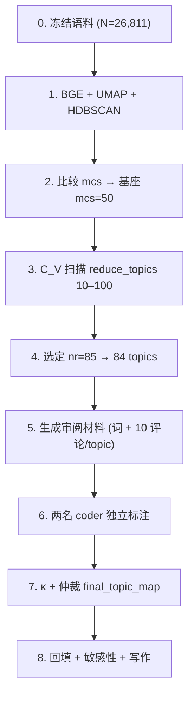

# 主题挖掘与人工归并流程（Topic Discovery Review）

> **实验 run**：`2026-05-27_topic_merged_bge_hdbscan_sensitivity`  
> **工作目录**：[`../output/experiments/2026-05-27_topic_merged_bge_hdbscan_sensitivity/topic_discovery_review/`](../output/experiments/2026-05-27_topic_merged_bge_hdbscan_sensitivity/topic_discovery_review/)  
> **代码入口**：`phase1/topic_discovery.py` · CLI：`./.venv/bin/python -m phase1.run_topic_discovery`  
> **论文 Methods 草稿**：[`method&data.md`](method&data.md) §主题聚类

---

## 1. 核心原则

| 原则 | 说明 |
|------|------|
| **分析单元** | 单条**评论**（`comment_id`），不是帖子、用户或讨论串 |
| **机器角色** | BERTopic + HDBSCAN 只提出**候选话语结构**（dense recurring discourse patterns） |
| **人工角色** | 开放归纳 → 归并 → 一致性检验 → 仲裁 → 冻结最终主题体系 |
| **主分析字段** | `topic_raw` / 最终主解的 reduced topic（非 outlier 评论） |
| **敏感性字段** | `topic_assigned`（`reduce_outliers` 后，outlier≈0.9%） |
| **可复现** | 语料 SHA、run id、参数、随机种子、输出清单均冻结 |

**一句话**：机器给 84 个 candidate topic；人给 domain / label；仲裁后回填到 26,811 条评论。

---

## 2. 流程总览



---

## 3. 分阶段说明

### 阶段 0：冻结语料

**做什么**：锁定 shared analyzable corpus 版本、输入哈希、剔除规则、分析单元。

**为什么**：后续所有 machine topic 与人工 label 必须可审计、可复跑。

**关键细节**：
- 原始 unified 评论 41,251 → shared corpus **26,811**
- 剔除：过短、有效词不足、重复正文等（见 `config.json` → `summary_corpus`）

**产物**：
- [`corpus_freeze.json`](../output/experiments/2026-05-27_topic_merged_bge_hdbscan_sensitivity/topic_discovery_review/corpus_freeze.json)

---

### 阶段 1：Embedding + HDBSCAN 候选

**做什么**：`BAAI/bge-base-zh-v1.5` → UMAP(5d, seed=42) → BERTopic + HDBSCAN；比较 mcs = 30 / 50 / 80 / 100。

**为什么**：在向量空间发现稠密、可重复的话语团块；mcs 决定粒度与 mega-cluster 风险。

**关键细节**：

| mcs | n_topics | raw outlier | 最大簇占有效文档 |
|-----|----------|-------------|------------------|
| 30 | 140 | 39.2% | 6.5% |
| **50** | **88** | **44.4%** | **7.6%** |
| 80 | 37 | 37.5% | **39.4%** |
| 100 | 31 | 40.6% | 39.2% |

**结论**：选 **mcs=50** 作基座——足够细、无 dominant mega-cluster；拒绝 mcs=80/100。

**产物**：
- [`hdbscan_candidate_summary.csv`](../output/experiments/2026-05-27_topic_merged_bge_hdbscan_sensitivity/topic_discovery_review/hdbscan_candidate_summary.csv)
- `bert_hdbscan_mcs50/doc_topics.csv`（含 `topic_raw`, `topic_assigned`）

**Outlier（44.4%）**：低密度语义长尾的保守标记，不是 pipeline 失败；论文中需报告并解释覆盖范围。

---

### 阶段 2：Topic-number selection（C_V 扫描）

**做什么**：在 mcs=50 已 fit 模型上，对 `reduce_topics(nr)` 扫描 *nr* ∈ {10, 15, …, 100}（步长 5）；每点计算 C_V + 结构诊断。

**为什么**：不能因「mcs=50 可审阅」就跳过 topic 数选择；需系统回答「多少个 machine topic 进入人工归并」。

**关键细节**：
- C_V：gensim `c_v`，jieba 分词语料
- 结构 guard：最大簇占比 ≤12%；topic 数约 40–100
- **拒绝 blind max-C_V**：*nr*=50 时 C_V≈0.683，但最大簇 **20%**
- **最终选择**：**`reduce_topics(nr=85)`** → 84 topics，C_V≈0.559，最大簇 **7.6%**

**mcs=50 与 reduce_topics(85) 的区别**：

| | HDBSCAN mcs=50 | reduce_topics(nr=85) |
|---|---|---|
| 步骤 | 首次密度聚类 | 在已有 topic 上后验合并 |
| 是否重跑 embedding | 是 | 否 |
| topic 数 | 88 | 84 |
| outlier 率 | 44.4% | 不变 |

**产物**：
- [`topic_number_cv_curve.csv`](../output/experiments/2026-05-27_topic_merged_bge_hdbscan_sensitivity/topic_discovery_review/topic_number_cv_curve.csv) / [`.png`](../output/experiments/2026-05-27_topic_merged_bge_hdbscan_sensitivity/topic_discovery_review/topic_number_cv_curve.png)
- [`topic_number_selection_notes.md`](../output/experiments/2026-05-27_topic_merged_bge_hdbscan_sensitivity/topic_discovery_review/topic_number_selection_notes.md)
- [`final_model_selection.json`](../output/experiments/2026-05-27_topic_merged_bge_hdbscan_sensitivity/topic_discovery_review/final_model_selection.json)
- [`final_model/`](../output/experiments/2026-05-27_topic_merged_bge_hdbscan_sensitivity/topic_discovery_review/final_model/)（`topics_final.csv`, `doc_topics_final.csv`）

---

### 阶段 3：生成人工审阅材料 ✅ 已完成

**做什么**：为 84 个 machine topic 生成 coder 证据包。

**为什么**：不能只看 top terms 或高赞；需防单帖支配、高赞偏差。

**抽样策略（每 topic 10 条评论）**：
- 3 条 top-like
- 4 条 cross-post（每帖最多 1 条，优先高赞）
- 3 条 random（固定种子，按 topic 偏移）

**证据阅读顺序**：
1. `top_terms` + `representative_docs`
2. `sample_comments_10` / `topic_comment_samples_final_nr85.csv`
3. 高赞仅作社会可见度参考，不作主证据

**诊断字段**：
- `top_post_share_raw` > 0.30 → 单帖支配风险（见 `high_risk_topics_final_nr85.csv`）
- `level1_share_raw` / `level2_share_raw` → 一级 vs 二级回复结构

**产物**：

| 文件 | 用途 |
|------|------|
| [`coder1_sheet_final_nr85.csv`](../output/experiments/2026-05-27_topic_merged_bge_hdbscan_sensitivity/topic_discovery_review/coder1_sheet_final_nr85.csv) | Coder A 正式标注表 |
| [`coder2_sheet_final_nr85.csv`](../output/experiments/2026-05-27_topic_merged_bge_hdbscan_sensitivity/topic_discovery_review/coder2_sheet_final_nr85.csv) | Coder B 正式标注表 |
| [`topic_comment_samples_final_nr85.csv`](../output/experiments/2026-05-27_topic_merged_bge_hdbscan_sensitivity/topic_discovery_review/topic_comment_samples_final_nr85.csv) | 84×10 结构化评论（推荐 Excel 按 topic_id 筛选） |
| [`topic_review_sheet_final_nr85.csv`](../output/experiments/2026-05-27_topic_merged_bge_hdbscan_sensitivity/topic_discovery_review/topic_review_sheet_final_nr85.csv) | 完整审阅表 |
| [`high_risk_topics_final_nr85.csv`](../output/experiments/2026-05-27_topic_merged_bge_hdbscan_sensitivity/topic_discovery_review/high_risk_topics_final_nr85.csv) | 优先标注 |
| [`topic_coding_codebook.md`](../output/experiments/2026-05-27_topic_merged_bge_hdbscan_sensitivity/topic_discovery_review/topic_coding_codebook.md) | 编码规则 |

⚠️ `hdbscan_mcs50_*` 为流程原型，**勿用于正式标注**。

---

### 阶段 4：人工标注 🔄 进行中

**做什么**：两名 coder 独立填写每行 `domain` / `label` / `notes`（84 行 = 84 个 machine topic）。

**字段说明**：

| 列 | 含义 |
|----|------|
| `domain` | 较高层话语域（第一轮开放命名，事后合并同义） |
| `label` | 该 machine topic 的具体主题名 |
| `notes` | 依据、边界、混杂点 |
| `mixed/unclear` | 证据不足时允许，勿强行解释 |

**操作步骤**：
1. 各用独立 coder 表，**互不可见**
2. 建议顺序：high_risk → 按 `raw_count` 降序 → 小 topic
3. 完成后另存为 `coder1_sheet_final_nr85_done.csv`、`coder2_sheet_final_nr85_done.csv`

---

### 阶段 5：一致性与仲裁 ⏳ 待做

**做什么**：Cohen's κ → 审查分歧 → 仲裁 → 冻结 `final_topic_map.csv`。

**命令**：
```bash
./.venv/bin/python -m phase1.run_topic_discovery --step agreement
```

**产物**：
- `coder_agreement_summary.csv`（domain κ 为主，label κ 为辅）
- `coder_disagreements.csv`
- `final_topic_map.csv`（`final_domain`, `final_label`, `adjudication_notes`）

详见 [`adjudication_guide.md`](../output/experiments/2026-05-27_topic_merged_bge_hdbscan_sensitivity/topic_discovery_review/adjudication_guide.md)。

**冻结规则**：定稿后 rename 为 `final_topic_map_frozen.csv`，不可在无新 run id 下修改。

---

### 阶段 6：验证、回填与敏感性 ⏳ 待做

**做什么**：
- 纯度抽查（`purity_validation_sample.csv`）
- 将 final labels 回填评论层
- 描述统计 + 多维度敏感性

**命令**：
```bash
./.venv/bin/python -m phase1.run_topic_discovery --step backfill
```

**敏感性维度**（`sensitivity/`）：
- 相邻 *nr* 候选（75 / 85 / 90）
- raw vs assigned outlier 分布
- alternate HDBSCAN mcs
- 高 `top_post_share_raw` topic

**产物**：
- `comments_with_final_domains.csv`
- `final_domain_descriptive_stats.csv`
- `final_domain_by_robot_status.csv`

---

## 4. 关键数字速查

| 指标 | 值 |
|------|-----|
| Shared corpus | 26,811 评论 |
| HDBSCAN 基座 | mcs=50，88 raw topics |
| 最终主解 | reduce_topics(nr=85)，**84 topics** |
| Raw outlier | 44.4% |
| Assigned outlier（敏感性） | 0.9% |
| 最大簇占比（最终） | 7.6% |
| 人工待标 | 84 行 / coder |
| 每 topic 评论样本 | 10 条 |

---

## 5. 复现命令

```bash
# 机器流程（冻结 → 选模 → 审阅材料 → 敏感性 → 文档）
./.venv/bin/python -m phase1.run_topic_discovery --step all

# 分步
./.venv/bin/python -m phase1.run_topic_discovery --step freeze
./.venv/bin/python -m phase1.run_topic_discovery --step select
./.venv/bin/python -m phase1.run_topic_discovery --step review
./.venv/bin/python -m phase1.run_topic_discovery --step sensitivity
./.venv/bin/python -m phase1.run_topic_discovery --step document

# 人工完成后
./.venv/bin/python -m phase1.run_topic_discovery --step agreement
./.venv/bin/python -m phase1.run_topic_discovery --step backfill
```

完整产物清单：[`output_manifest.csv`](../output/experiments/2026-05-27_topic_merged_bge_hdbscan_sensitivity/topic_discovery_review/output_manifest.csv)

---

## 6. 相关文档

| 文档 | 位置 |
|------|------|
| 论文 Methods 段落 | [`method&data.md`](method&data.md) |
| 技术细节（英文） | [`METHODS.md`](../output/experiments/2026-05-27_topic_merged_bge_hdbscan_sensitivity/topic_discovery_review/METHODS.md) |
| 复现说明 | [`REPRO.md`](../output/experiments/2026-05-27_topic_merged_bge_hdbscan_sensitivity/topic_discovery_review/REPRO.md) |
| 编码规则 | [`topic_coding_codebook.md`](../output/experiments/2026-05-27_topic_merged_bge_hdbscan_sensitivity/topic_discovery_review/topic_coding_codebook.md) |
| 数据预处理 | [`data/clean/data_preprocessing_protocol.md`](../data/clean/data_preprocessing_protocol.md) |
| 探索 notebook | [`notebooks/topic_discovery_hdbscan_review.ipynb`](../notebooks/topic_discovery_hdbscan_review.ipynb) |

---

## 7. 当前状态（2026-05-31）

- [x] 语料冻结
- [x] HDBSCAN 候选比较 → mcs=50
- [x] C_V 扫描 → nr=85
- [x] 审阅材料（含 10 评论/topic）
- [ ] Coder 1 独立标注
- [ ] Coder 2 独立标注
- [ ] 一致性 + 仲裁
- [ ] 回填 + 最终描述统计

