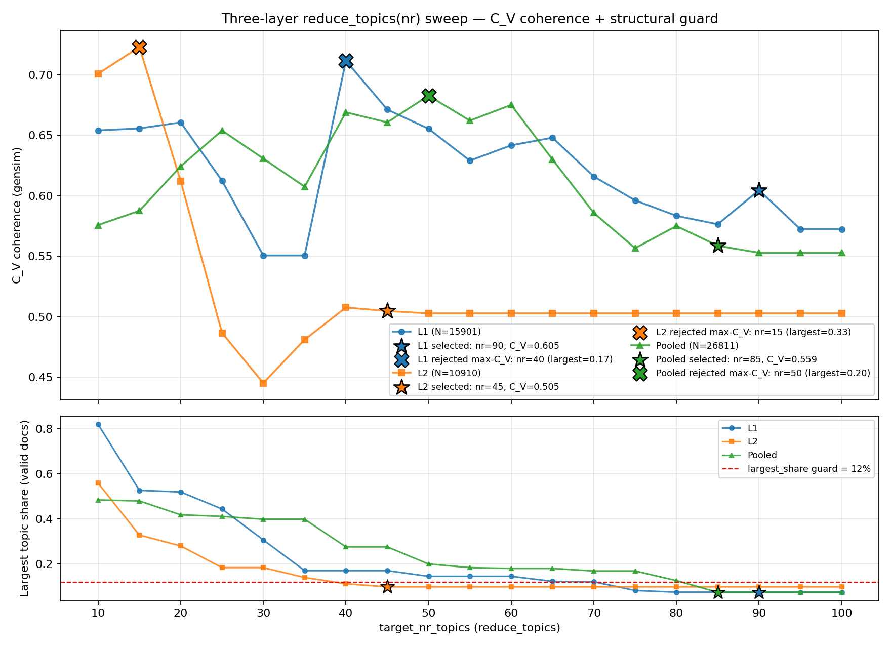
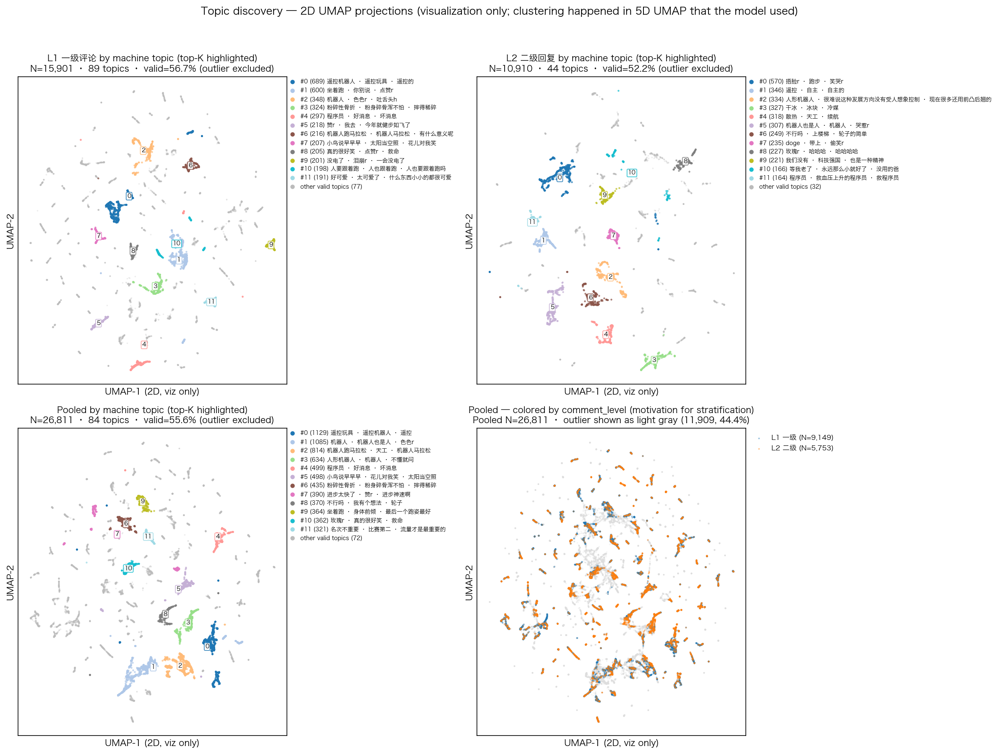
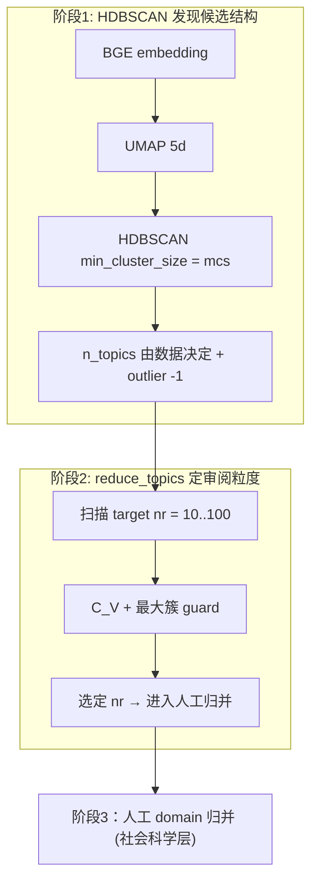
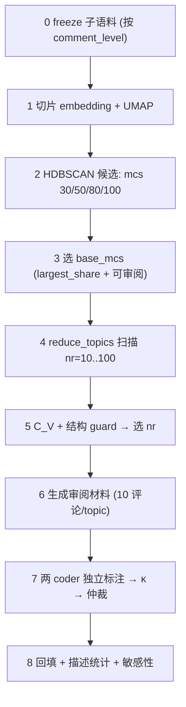

# 主题挖掘与人工归并流程（Topic Discovery Review）

> **实验 run**：`2026-05-27_topic_merged_bge_hdbscan_sensitivity`
> **代码入口**：[`phase1/topic_discovery.py`](../phase1/topic_discovery.py) · CLI [`phase1/run_topic_discovery.py`](../phase1/run_topic_discovery.py)
> **实习生 Runbook**：[`topic_discovery_intern_runbook.md`](topic_discovery_intern_runbook.md)
> **论文 Methods 草稿**：[`method&data.md`](method&data.md) §主题聚类
> **变更（2026-05-31）**：由「pooled 单层」改为 **L1/L2 分层并跑**；pooled 降为敏感性附录。

---

## §0 给接手者的最短路径

1. 读本节 + [`topic_discovery_intern_runbook.md`](topic_discovery_intern_runbook.md)。
2. 直接打开 **L1** `coder1_sheet_final_nr90.csv`（89 行）开始标注；标完做 agreement → 仲裁 → backfill。
3. 再开 **L2** `coder1_sheet_final_nr45.csv`（44 行）重复。
4. Pooled 84 行**不再主标**，仅作敏感性对照。
5. 机器流程已跑完；如需重跑，命令与验收清单见 §6、§7 与 Runbook。

| 我要…… | 去哪 |
|--------|------|
| 跑 L1/L2 全流程 | Runbook §C |
| 标注 SOP | Runbook §D |
| 选 mcs/nr 的依据 | 本文 §3 + 该层 `topic_number_selection_notes.md` |
| 列释义 | 本文 **附录 A** |
| 历史决策 / 阶段图 | 本文 §4 |

---

## 1. 研究设计：为什么分 L1/L2

| 维度 | 一级评论 L1 | 二级回复 L2 |
|------|-------------|-------------|
| 语用功能 | 直接发起话题、表态、提问 | 对一级或对同帖他人回复的响应、调侃、追问 |
| 平均长度 / 上下文依赖 | 较长、自包含 | 较短、依赖父评 / 帖子上下文 |
| 主题分布 | 体现「主话题」 | 体现「互动话语」与「立场回响」 |

**Pooled 风险**：两类语用功能混入同一聚类，会让 HDBSCAN 把短回复打成 outlier 或并入长评论形成「杂物桶」。
**做法**：L1 与 L2 **分别**做 HDBSCAN 候选发现、C_V 定 nr 与人工 domain 归并；pooled 仍报告但仅作敏感性。

**分析单元仍是单条评论**（`comment_id`）；只是按 `comment_level` 分轨。

---

## 2. 三层对照表（机器结果，2026-05-31）

| 层 | 目录 | N | base_mcs | nr | topic 数 | largest_share | raw outlier | C_V |
|----|------|---|----------|----|----------|---------------|-------------|-----|
| **L1 一级**（主） | [`topic_discovery_l1/`](../output/experiments/2026-05-27_topic_merged_bge_hdbscan_sensitivity/topic_discovery_l1/) | 15,901 | **30** | **90** | **89** | 7.6% | 43.3% | 0.605 |
| **L2 二级**（主） | [`topic_discovery_l2/`](../output/experiments/2026-05-27_topic_merged_bge_hdbscan_sensitivity/topic_discovery_l2/) | 10,910 | **30** | **45** | **44** | 10.0% | 47.8% | 0.505 |
| Pooled（敏感性） | [`topic_discovery_review/`](../output/experiments/2026-05-27_topic_merged_bge_hdbscan_sensitivity/topic_discovery_review/) | 26,811 | 50 | 85 | 84 | 7.6% | 44.4% | 0.559 |

**C_V 三层对照图**（标注各层选定点 ★ 与被结构 guard 拒绝的 max-C_V 点 ✗）：



要点：
- L2 在 nr≥45 之后 C_V 完全平直（≈0.503），因为 base_mcs=30 的 HDBSCAN 输出上界就是 50 topics，再大的 nr 也不会继续合并 → 选 nr=45 vs nr=50 等价，**不是人为偏好**。
- L1 在 nr=75–95 区间 largest_share 稳定在 7.6%，C_V 在 0.57–0.60 间小幅波动；选 nr=90 对 ±5 不敏感。
- 三条 max-C_V 候选（L1=40, L2=15, Pooled=50）均被 12% guard 拒（X 标记），表明 blind max-C_V 在三层都会落入 mega-cluster 风险区。

**Embedding 2D 可视化**（每个评论 = 一个点；颜色 = machine topic 编号）：



**注意：2D 投影仅作可视化**。HDBSCAN 聚类发生在模型实际使用的 5D UMAP 空间；该图是把同一份 5D 表示再降一次（5D→2D，random_state=42，metric=euclidean），以便人眼看出簇结构与层间分布差异。**簇是否在 2D 里看着分得开 ≠ 模型聚类的最终判据**。

要点：
- **L1（左上）**：89 个 topic，前 12 大 topic（共 ~37% valid 评论）以彩色标出，其余 77 topic 灰色。可见多个语义分离的小簇（遥控机器人、坐着跑、粉碎性骨折、机器人跑马拉松、程序员等）。
- **L2（右上）**：44 个 topic，前 12 占比更高（~36% valid）。簇更紧凑、数量更少，符合短回复语义稀疏的预期；最大簇 #0 全是「捂脸/跑步/笑哭」类反应词，是典型的二级回复语用。
- **Pooled by topic（左下）**：84 个 topic 在同一张图上展开；结构与 L1 大体相似但混入了一些纯反应类簇。
- **Pooled by comment_level（右下，关键诊断）**：蓝色=L1、橙色=L2、灰色=outlier。可见两层在大多数簇内部 **同时存在且大量交错**（salt-and-pepper），但部分区域明显以橙色（L2-only）或蓝色（L1-only）为主——这正是分层的依据：**L1/L2 共享主题邻域**（机器人本体讨论），**但语用密度结构不同**，故 HDBSCAN 的 `mcs` 最优值随层而异（L1/L2 mcs=30 vs Pooled mcs=50）。

**HDBSCAN mcs 候选比较**（每层独立扫 30/50/80/100）：

| mcs | L1 n_topics | L1 largest | L1 outlier | L2 n_topics | L2 largest | L2 outlier |
|-----|-------------|------------|------------|-------------|------------|------------|
| 30  | **95**      | **7.6%**   | 43.3%      | **50**      | **10.0%**  | 47.8%      |
| 50  | 52          | 8.9%       | 50.7%      | 28          | 15.0%      | 44.0%      |
| 80  | 29          | 19.1%      | 50.4%      | 3           | **93.9%**  | 0.3% (collapsed) |
| 100 | 2           | **99.1%**  | 0.7% (collapsed) | 2     | **94.7%**  | 0.9% (collapsed) |

L1 与 L2 在 mcs∈{80,100} 都出现 mega-cluster 塌缩 → 均拒绝；mcs=30 同时满足「largest_share ≤ 12%」与可审阅 topic 数，故两层均选 **mcs=30**（与 pooled 选 mcs=50 不同，原因是层内样本较小、密度结构更稀疏）。

---

## 2.1 严谨评估（Evaluation）

**主清单**（人工维护，含自动化指标 + 人工 checkbox + 解读）：

- [`EVALUATION_CHECKLIST.md`](../output/experiments/2026-05-27_topic_merged_bge_hdbscan_sensitivity/EVALUATION_CHECKLIST.md)
- 机器指标 CSV：[`layer_cluster_metrics.csv`](../output/experiments/2026-05-27_topic_merged_bge_hdbscan_sensitivity/layer_cluster_metrics.csv)

重算命令（独立脚本，不改 pipeline）：

```bash
./.venv/bin/python -m tools.compute_layer_cluster_metrics \
  --run-id 2026-05-27_topic_merged_bge_hdbscan_sensitivity
```

**要点（2026-05-31）**：三层 silhouette（5D）均 >0.6；DBCV 均 <0.4（高 outlier 下常见，不以单项否定）；L2 C_V=0.505 标 warn。2D embedding 图仍仅作 sanity check，详见 checklist §4 与 [`visual.md`](../phase1/plan/visual.md) §3。

---

## 3. 参数说明（HDBSCAN「要不要定类别数」）

**不需要、也不应该在 HDBSCAN 阶段预设最终 topic 数 K。** 流程按两阶段定粒度：



| 参数 | 控制什么 | 是否「定类别数」 |
|------|----------|------------------|
| **`mcs`（min_cluster_size）** | 多「密」才算一个簇；越大 → topic 越少、簇越大 | **否**；只定密度门槛 |
| `min_samples` | 核心点邻域（这里默认 = mcs） | 否 |
| **`reduce_topics(nr)`** | 把已有 topic **合并**到目标数 | **是（目标 K）**，但是 BERTopic 上的后验合并，不是 HDBSCAN 的 K |
| 人工 `domain` | 把 N 个 machine topic 归并为更少的话语域 | 社会科学主题层，第三层 |

**Outlier 含义**：HDBSCAN 把不属于任何稠密簇的评论标 `topic_raw = -1`；这是对语义长尾的**保守**处理，不是 pipeline 失败。主分析使用 raw 非 outlier；`topic_assigned`（reduce_outliers 后）仅作覆盖率敏感性。

---

## 4. 每层独立的 0–8 阶段流程



**实现要点**：
- 父 run 一次 BGE encode → 全库 `embeddings.npy`（26,811×768）；L1/L2 **按 row index 切片**，避免重复 encode。
- 每层 UMAP/HDBSCAN/BERTopic 完全独立；模型与 `doc_topics.csv` 保存到 `topic_discovery_l{1,2}/bert_hdbscan_mcs{K}/`（**不污染**父 run 下的 pooled `bert_hdbscan_mcs*`）。
- 每层 `final_model/doc_topics_final.csv` 行数 = 该层 N；含 `topic_raw`、`topic_reduced`。

---

## 5. 抽样、证据与诊断（每层一致）

每 topic 10 条评论：3 top-like + 4 cross-post（每帖至多 1 条）+ 3 random（seed=42 + topic_id 偏移）。

**证据阅读顺序**：`top_terms` → `sample_comments_10` → `representative_docs`（辅助）。
高赞仅作社会可见度参考，**不作主证据**。

**诊断字段**：
- `top_post_share_raw` > 0.30 → 单帖支配风险（高优先审）；输出在 `high_risk_topics_final_nr*.csv`。
- L1/L2 表内**不再有** `level1_share_raw`/`level2_share_raw`（单层内恒定 1.0/0.0，已删除以避免误导）。
- pooled 表保留 `level1_share_raw`/`level2_share_raw`，用于回看哪些 pooled topic 在分层后会被「拆」或「合」。

---

## 6. 复现命令

```bash
# 机器全流程（两层独立；--base-mcs 30 是 2026-05-31 的决策值，新数据需重选）
./.venv/bin/python -m phase1.run_topic_discovery --comment-level 1 --base-mcs 30 --step all
./.venv/bin/python -m phase1.run_topic_discovery --comment-level 2 --base-mcs 30 --step all

# 分步（每步均可单独跑）
./.venv/bin/python -m phase1.run_topic_discovery --comment-level 1 --base-mcs 30 --step freeze
./.venv/bin/python -m phase1.run_topic_discovery --comment-level 1 --base-mcs 30 --step fit
./.venv/bin/python -m phase1.run_topic_discovery --comment-level 1 --base-mcs 30 --step select
./.venv/bin/python -m phase1.run_topic_discovery --comment-level 1 --base-mcs 30 --step review
./.venv/bin/python -m phase1.run_topic_discovery --comment-level 1 --base-mcs 30 --step codebook
./.venv/bin/python -m phase1.run_topic_discovery --comment-level 1 --base-mcs 30 --step sensitivity
./.venv/bin/python -m phase1.run_topic_discovery --comment-level 1 --base-mcs 30 --step validate
./.venv/bin/python -m phase1.run_topic_discovery --comment-level 1 --base-mcs 30 --step document

# 标注完成后
./.venv/bin/python -m phase1.run_topic_discovery --comment-level 1 --base-mcs 30 --step agreement
./.venv/bin/python -m phase1.run_topic_discovery --comment-level 1 --base-mcs 30 --step backfill
# L2 同理（--comment-level 2 --base-mcs 30）
```

完整产物清单：每层 `output_manifest.csv`。

---

## 7. 当前状态（2026-05-31）

- [x] Pooled 机器流程（base_mcs=50, nr=85, 84 topics）
- [x] **L1 机器全流程**（base_mcs=30, nr=90, 89 topics）
- [x] **L2 机器全流程**（base_mcs=30, nr=45, 44 topics）
- [ ] L1 Coder 1 独立标注
- [ ] L1 Coder 2 独立标注
- [ ] L1 一致性 + 仲裁 + 回填
- [ ] L2 Coder 1 独立标注
- [ ] L2 Coder 2 独立标注
- [ ] L2 一致性 + 仲裁 + 回填
- [ ] 三层最终 domain 对照（pooled vs L1 vs L2）

---

## 8. 相关文档

| 文档 | 位置 |
|------|------|
| 实习生 Runbook | [`topic_discovery_intern_runbook.md`](topic_discovery_intern_runbook.md) |
| 论文 Methods 段落 | [`method&data.md`](method&data.md) |
| 技术细节（英文，pooled） | [`METHODS.md`](../output/experiments/2026-05-27_topic_merged_bge_hdbscan_sensitivity/topic_discovery_review/METHODS.md) |
| 复现说明（每层） | `<level_dir>/REPRO.md` |
| 编码规则（每层） | `<level_dir>/topic_coding_codebook.md` |
| 数据预处理 | [`data/clean/data_preprocessing_protocol.md`](../data/clean/data_preprocessing_protocol.md) |
| Phase1 总 RUNBOOK | [`phase1/RUNBOOK.md`](../phase1/RUNBOOK.md) |

---

## 附录 A：Coder 表与样本表列释义

### A.1 `coder{1,2}_sheet_final_nr{K}.csv`（每层一份）

| 列 | 含义 | 是否可改 |
|----|------|----------|
| `topic_id` | machine topic id（≥0；-1 为 outlier，不进表） | ❌ |
| `raw_count` | 该 topic 的评论数（非 outlier） | ❌ |
| `assigned_count` | reduce_outliers 后的评论数（敏感性参考） | ❌ |
| `n_posts_raw` | 该 topic 覆盖的帖子数 | ❌ |
| `top_post_share_raw` | 最大单帖占比；>0.30 视为单帖支配风险 | ❌ |
| `top_terms` | c-TF-IDF（含 KeyBERT/MMR 重排）前 12 词 | ❌ |
| `representative_docs` | BERTopic 选的代表文（**辅助**证据） | ❌ |
| `sample_comments_10` | **主证据**：10 条评论拼接（详见 `topic_comment_samples_*.csv`） | ❌ |
| **`domain`** | 较高层话语域（开放命名 → 同义合并） | ✅ |
| **`label`** | 该 topic 的具体主题名 | ✅ |
| **`notes`** | 依据、边界、混杂点；允许 `mixed/unclear` | ✅ |

**Pooled** 表额外含 `level1_share_raw` / `level2_share_raw`；L1/L2 表内已删除（单层内恒定）。

### A.2 `topic_comment_samples_final_nr{K}.csv`（结构化长表）

| 列 | 含义 |
|----|------|
| `topic_id` | 与 coder 表对齐 |
| `sample_rank` | 1..10 |
| `sample_source` | `top_like` / `cross_post` / `random` / `fill` |
| `comment_id` / `帖子id` / `comment_level` / `like_count` / `reply_count` / `robot_status` / `human_role` | 评论元数据 |
| `content` | 原文 |

**建议**：用 pandas 或 Excel 按 `topic_id` 筛选；`sample_comments_10` 内联文本只是 fallback，长表更易读。

### A.3 `representative_docs` vs `sample_comments_10`

- `representative_docs`：BERTopic 在 c-TF-IDF 空间挑的中心文；可能偏长 / 偏「典型词」。
- `sample_comments_10`：我们二次抽样得到的 top_like + cross_post + random 组合；用于**对抗高赞偏差与单帖支配**。

**永远以 `sample_comments_10` 为主证据**；representative_docs 仅作参考。
