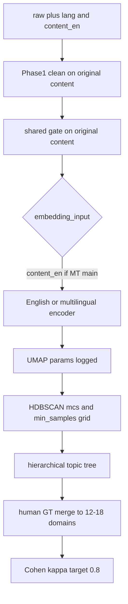

# 主题建模升级方案（设计文档）

> **状态**：设计稿（2026-09-09）。本轮**不写代码、不重跑实验**。  
> **文献依据**：[tools/analysis skill/topic modeling.md](../tools/analysis%20skill/topic%20modeling.md)（TikTok/小红书 BERTopic 期刊案例综述）。  
> **姊妹文档**（封闭类目 LLM 打标，非 BERTopic）：[codebook_llm_labeling.md](codebook_llm_labeling.md)。

## 0. 两条管线，禁止混叙事

| 管线 | 问什么 | 产出 | 当前冻结 |
|------|--------|------|----------|
| **发现**（本文） | 评论里反复出现哪些语义邻域？ | machine topic → 人工 domain | XHS `2026-05-27_topic_merged_bge_hdbscan_sensitivity` |
| **编码**（姊妹文） | 立场/形象/四维极性是什么？ | 封闭 codebook 标签 | 见 [codebook_llm_labeling.md](codebook_llm_labeling.md) |

- 论文「主题数」= **人工 domain 数**（目标约 12–18），不是 L1 的 89 或 L2 的 44 个 machine topic。  
- 禁止用 LLM 封闭类目当 HDBSCAN 的 K，或把 discovery 簇直接当 stance/domain ground truth。  
- 05-27 run **不覆盖、不重 encode**；TikTok `2604-marathon` 与任何英译主分析须 **新 `run_id`**。

---

## 1. 期刊要素 vs 现状（对照表）

综述第六节「高水平期刊应包含的要素」与仓库现状对照如下。

| 要素 | 期刊惯例（综述案例） | 本项目现状 | 缺口 |
|------|----------------------|------------|------|
| **语料审计链** | 原始 → 清洗 → 分析样本，逐级 N 与剔除理由（Frontiers AI 伴侣） | Phase 1 有 `phase1_preprocess_stage_summary.csv`；shared 有 `shared_corpus_summary.json` | **HDBSCAN Topic -1 未进同一条链**；Methods 未收成「shared → in-cluster → outlier」一行表 |
| **抽样说明** | API / 爬虫 / 数据捐赠 + hashtag 或 top-N 逻辑 | XHS 33 帖目的性抽样；TikTok 143 帖马拉松抓取 | 须写清「非平台概率样本」；TikTok 运动会仅 15 帖有评论 |
| **嵌入模型** | 语种匹配优先于模型大小（中文 bert/text2vec；多语 distilbert-multilingual） | XHS：`BAAI/bge-base-zh-v1.5` ✓ | TikTok shared **~84% 英文** 仍不宜用 zh-only encoder |
| **UMAP 参数** | 常披露 n_neighbors、n_components、min_dist、metric、seed | n_components=5，random_state=42 ✓ | n_neighbors / min_dist 未系统写入 run `config.json` |
| **HDBSCAN 调参** | TopicTuner 或 mcs × min_samples 网格（ICWSM 中/日/韩解耦） | 扫 mcs 30/50/80/100；**min_samples 写死 = mcs**（`topic_discovery.py`） | 未扫 min_samples 维 |
| **主题数确定** | 数百细簇 → 层次树 / 扎根 → 12–18 报告主题 | `reduce_topics(nr)` + C_V + 12% 最大簇 guard | 无层次主题树；89/44 仍偏「审阅粒度」非「报告主题数」 |
| **一致性指标** | C_V / UMass 作辅证，非唯一依据 | C_V 用于 nr 选择 ✓ | 混语/英译库上 C_V 不可靠；L2 C_V=0.505 已 warn |
| **聚类效度** | Silhouette/CH（K-means）或 DBCV（HDBSCAN）；**Topic -1 占比必报** | silhouette 5D>0.6；DBCV<0.4 warn；outlier L1 43.3% / L2 47.8% | 覆盖率（in-cluster / shared）未与 -1 并列成主表 |
| **人工验证** | 双 coder κ≥0.8（ICWSM、RedNote） | coder 表已生成；**κ 未算**（codebook 写 0.6） | 人工 domain 归并未完成 |
| **LLM 配套** | 情感/立场 LLM + 人工核验 1000+ 条 | 有 `label_codebook_llm` 与 `human_label_llm` MVP | **未进入主题命名/效度**；见姊妹文档 |
| **L2 上下文** | 回复链递归补语境（RedNote depth=10） | L2 独立 encode 单条原文 | 无父评拼接 |
| **时序 / 跨模态** | 综述空白 | 有 `post_media.csv` 旁路 | P2，不纳入下一 run |

**05-27 三层机器结果（冻结，仅 XHS 旧 shared N=26,811）**

| 层 | N | mcs | nr | topics | largest | outlier | C_V |
|----|---|-----|-----|--------|---------|---------|-----|
| L1 | 15,901 | 30 | 90 | 89 | 7.6% | 43.3% | 0.605 |
| L2 | 10,910 | 30 | 45 | 44 | 10.0% | 47.8% | 0.505 |
| Pooled | 26,811 | 50 | 85 | 84 | 7.6% | 44.4% | 0.559 |

详见 [topic_discovery_review.md](topic_discovery_review.md)、[EVALUATION_CHECKLIST.md](../output/experiments/2026-05-27_topic_merged_bge_hdbscan_sensitivity/EVALUATION_CHECKLIST.md)。

---

## 2. 已对齐、不必推倒

以下与综述及 [lessons_learned_topic_modeling.md](idea/lessons_learned_topic_modeling.md) 一致，**保留**：

1. **Shared corpus 先于模型比较**（M7）：LDA / NMF / BERTopic 共用同一批评论。  
2. **LDA 用 CountVectorizer，NMF 用 TF-IDF**（M6）。  
3. **BGE encode 原文**；停用词只在 c-TF-IDF / jieba 路径（C2）——*英译主分析 run 除外，见 §4*。  
4. **不用 lexicon 预过滤** 再聚类（M1/M2）。  
5. **L1/L2 分轨**动机与 pooled 敏感性附录。  
6. **横切用帖内比例** + leave-one-post-out（M8）。  
7. **新实验新 `run_id`** + `registry.csv` + input SHA（P1/P3）。  
8. **machine topic ≠ 社会科学主题**；人工 domain 归并是第三层。

---

## 3. 升级原则（避免误抄文献）

### 3.1 细簇多、报告主题少

ICWSM 案例：245–302 个 HDBSCAN 细簇 → 编码员合并 → **17–18 个**跨国可比主题。  
我们 L1 `nr=90` 得 89 个 machine topic，是 **可审阅的合并后粒度**，仍不是论文「主题数」。最终 domain 目标 **12–18**，machine nr 只进附录或敏感性。

### 3.2 不盲信 C_V 选 nr

L1 max C_V 在 nr=40（C_V=0.71）因 largest_share=17.2% 被拒；L2 max 在 nr=15（largest=33%）被拒——**正确做法**。  
升级后：混语 / 英译库上 **C_V 降为辅证**；主证据 = 最大簇占比、in-cluster 覆盖率、语言纯度、10 topic 人工可读性。

### 3.3 Topic -1 策略写死

| 策略 | 含义 | 适用 |
|------|------|------|
| **质量优先**（推荐主分析） | 主分析只用 `topic_raw ≠ -1`；显式报告 -1 量与占比 | Frontiers AI 伴侣 |
| **覆盖优先**（敏感性） | `reduce_outliers` → `topic_assigned`；或降低 min_samples | ICWSM 吸收小簇 |

**推荐组合**：主分析用 `topic_raw ≠ -1`（质量优先）；`topic_assigned` 仅作敏感性附录——与现 `doc_topics.csv` 列名一致，不另造第三套标签。

审计链必须含一行：**shared N → in-cluster N → outlier N（%）**。

### 3.4 英译是测量干预

若聚类输入改为 `content_en`：

- 不得再写「BGE 用原文 content」。  
- 05-27 与 TikTok 新 run **不可比**，除非 XHS 同套英译重跑。  
- 须报告 native-en vs MT 来源在每 topic 内的占比。  
- 翻译 prompt **不得**要求 neutral tone（见 [comment_lang/translate.py](../tools/comment_lang/translate.py) 现状需改）。

### 3.5 不与 XHS 混聚类

两平台抽样、语言构成、encoder 均不同。跨平台比较 = **各自 discovery → 人工对齐 domain 表**，非 pooled UMAP。

---

## 4. 目标管线与配置契约（TikTok `2604-marathon` 下一 run）

> 本节规定 **实施时** 写入 `config.json` 的字段；本轮不执行。

### 4.1 语料与行序

| 字段 | 规定 |
|------|------|
| 平台 / 批次 | `tiktok` / `2604-marathon` |
| clean | [data/clean/tiktok/2604-marathon/clean_comments_unified.csv](../data/clean/tiktok/2604-marathon/clean_comments_unified.csv) |
| shared | 同目录 `shared_analyzable_corpus.csv`（当前 N≈29,548；门控 v1 后重跑 Phase1 可能变） |
| 门控 | **始终**基于原文 `content` |
| 嵌入列 | 主分析：`content_en`（空译行单独标记 `mt_status`，禁止用 native 英文填非英空） |
| 对齐 | `embeddings.npy` 与 shared **按行 index**，非 `comment_id` join |
| 语言列 | `language` / `is_mixed` 必须保留在 shared |

TikTok 语言构成（shared，粗分）：英文 ~84%、中文 ~13%、混合 ~3%。日文在 `other` 中需 lingua 单独统计。

### 4.2 嵌入与预处理

| 项 | XHS 05-27（冻结） | TikTok 新 run |
|----|-------------------|---------------|
| Encoder | `BAAI/bge-base-zh-v1.5` | **不用 zh-only**；候选 `BAAI/bge-m3` 或 `intfloat/e5-base-v2` / `BAAI/bge-small-en-v1.5` |
| 输入文本 | 原文 `content` | 主：`content_en`；敏感性：原文 + 多语 encoder |
| 平台占位符 | `[赞R]` 等 | 译前剥 `[贴纸]`；原文样本表保留 |
| 抽词 | jieba + 中文停用词 | **英文** regex + `general_stopwords_en.txt`；C_V 仅在英文子集或停用 |

`load_topic_stopwords()` 当前未传 `platform`（`topic_modeling.py`）——TikTok run 须显式加载英文停用词。

### 4.3 UMAP / HDBSCAN

| 参数 | 规定 |
|------|------|
| UMAP | n_components=5，random_state=42；**额外记录** n_neighbors、min_dist、metric |
| HDBSCAN 网格 | min_cluster_size ∈ {30, 50, 80, 100} **且** min_samples ∈ {3, 10, mcs} 至少一组 ms < mcs |
| 选 mcs 依据 | largest_share ≤12%；可审阅 topic 数；**不**单独用 C_V 最高 |
| L1/L2 | **各自**重扫，禁止照搬 XHS mcs=30 / nr=90/45 |
| reduce_topics | 可选审阅切片；**不**当最终主题数；优先 `hierarchical_topics` 辅助归并 |

### 4.4 合并与验证

1. 层次主题树 + 双 coder **开放 domain** 归并 → 12–18 个报告主题。  
2. Cohen's κ **目标 0.8**（若沿用 0.6 须在 Methods 说明）。  
3. 每 topic：`top_post_share`、native-en vs zh/ja-MT 占比、代表 10 条（原文+译文并列）；**语言纯度过高时须在 Discussion 承认未实现跨语合并**。  
4. L2：encode / 人工读样时 **拼接父评 1 层**（敏感性）。  
5. LLM 主题命名：若用，双模型或人核，T=0.0–0.1，核验 n≥200。

### 4.5 建议 run_id 命名

```
2026-09-xx_topic_tiktok2604_en_bge_m3_hdbscan
```

登记 [output/experiments/registry.csv](../output/experiments/registry.csv)；**禁止**覆盖 `2026-05-27_topic_merged_bge_hdbscan_sensitivity`。

### 4.6 审计链模板（Methods 表）

| 阶段 | N | 剔除 / 说明 |
|------|---|-------------|
| raw 评论行 | （TikTok clean 前） | |
| clean | 36,742 | Phase1：emoji、@ 等 |
| shared | 29,548 | 门控 v1：长度、去重等 |
| HDBSCAN in-cluster | ~16,500（估 56%） | 1 − outlier_rate |
| HDBSCAN outlier (-1) | ~13,000（估 44%） | 须显式报告 |
| 人工 domain（目标） | 12–18 类 | 归并后 |

*outlier 率为 05-27 量级参考；TikTok 须实测写入 run 目录。*

### 4.7 流程图



---

## 5. 优先级

### P0（TikTok 主题可发表最低差）

- [ ] 嵌入语种与 `content_en` 契约写入 `config.json`  
- [ ] 审计链含 Topic -1  
- [ ] 英文 c-TF-IDF + 平台英文停用词  
- [ ] mcs 网格（该语料独立选，不抄 05-27）  
- [ ] 人工 domain 归并 + κ  
- [ ] 每 topic 源语言（native vs MT）构成  
- [ ] MT prompt 去 neutral；100 条原文/译文分层质检  

### P1

- [ ] min_samples 网格  
- [ ] 层次树辅助代替盲 `nr`  
- [ ] L2 父评拼接（encode 或读样）  
- [ ] 双 LLM 主题命名仅作辅助（非主分析）  

### P2（明确不纳入下一 run）

- topics over time  
- 评论 × 视频 caption 跨模态对齐  
- XHS 与 TikTok 同 embedding 空间重跑  
- 按 `robot_status` 分层重 fit HDBSCAN（已下线 CLI）  

---

## 6. 非目标（本轮设计）

- 不修改 [phase1/topic_modeling.py](../phase1/topic_modeling.py) / [phase1/topic_discovery.py](../phase1/topic_discovery.py)  
- 不重跑 encode、不覆盖 05-27  
- 不改 [tools/comment_lang/translate.py](../tools/comment_lang/translate.py)（仅文档要求）  
- 不将 BERTopic 与 codebook LLM 合并为一条 CLI  

---

## 7. 落地时要动的文件（实施阶段参考）

| 文件 | 改动方向 |
|------|----------|
| `phase1/topic_modeling.py` | `--text-column`；`load_topic_stopwords(platform=...)`；encoder 可配置 |
| `phase1/topic_discovery.py` | min_samples 网格；层次树导出；审计链 CSV |
| `phase1/run_topic_discovery.py` | 新参数暴露 |
| [README.md](../README.md) / Schema | 新 run 真源与英译契约 |
| `output/experiments/registry.csv` | 登记 TikTok run |
| `tools/compute_layer_cluster_metrics.py` | 覆盖率、语言纯度指标 |
| `writing/method&data.md` | Methods 段落同步 |

---

## 8. 相关文档

| 文档 | 用途 |
|------|------|
| [topic_discovery_review.md](topic_discovery_review.md) | 05-27 L1/L2 SOP |
| [topic_discovery_intern_runbook.md](topic_discovery_intern_runbook.md) | 标注流程 |
| [method&data.md](method&data.md) | 论文 Methods 草稿 |
| [codebook_llm_labeling.md](codebook_llm_labeling.md) | 立场/形象编码管线 |
| [README.md](../README.md) | 当前真源入口 |
